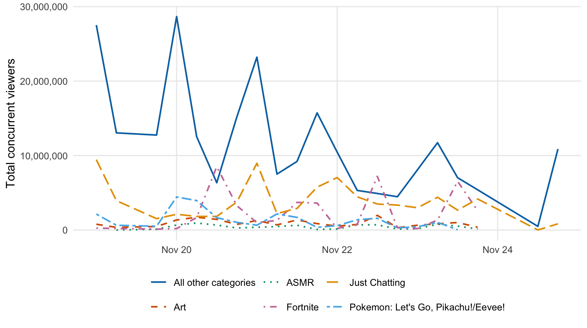
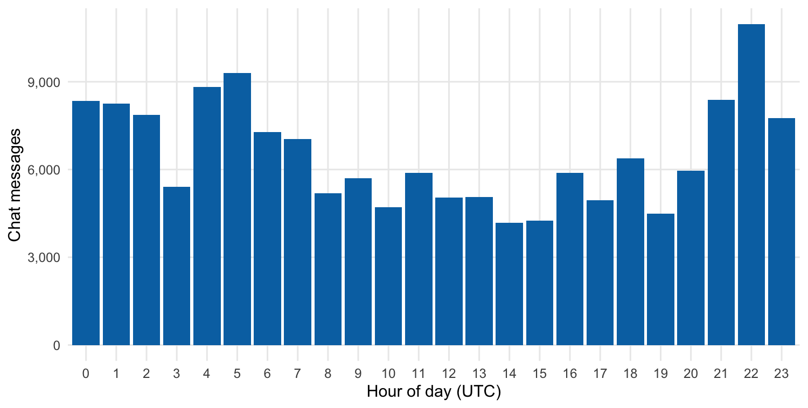
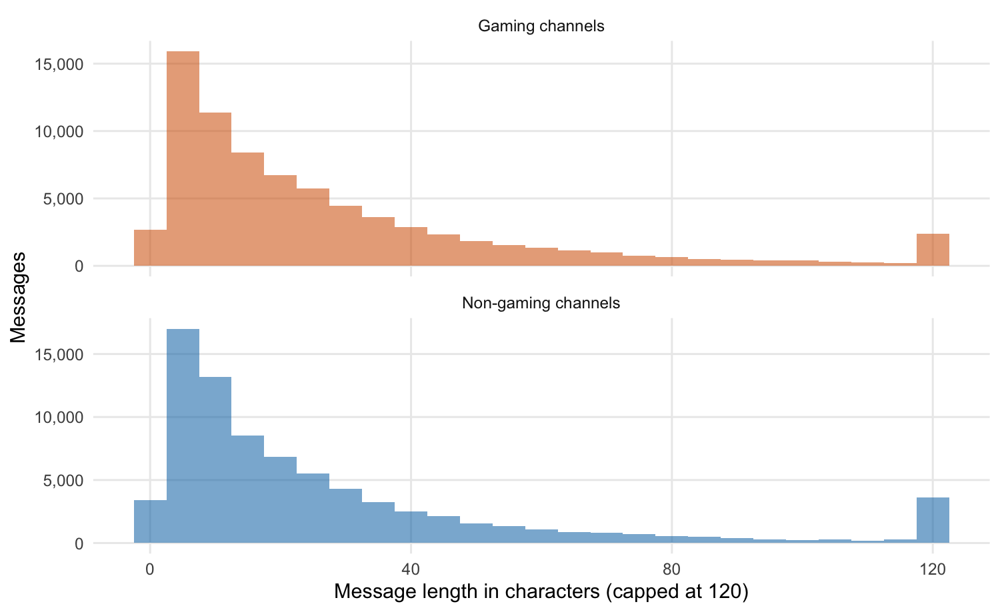

The chat table you collected cannot answer your research question. Not yet. The study asks whether chat behaves differently on gaming and non-gaming channels, and it operationalizes that through message length. But look at the table. There is no column for message length. There is no column saying whether a message came from a gaming channel or a non-gaming one. The timestamps are unreadable runs of digits. And the information that would settle the gaming question is not even in the chat table; it sits in a separate stream table that the chat table has no link to.

This is the ordinary situation at this stage of a study, and closing the gap is the work of this chapter. **Data wrangling** is the process of turning the data you collected into the data you can analyze: reshaping it, cleaning it, deriving the variables your codebook named, and joining separate tables into one. It is unglamorous, it is rarely mentioned in the published paper, and it is most of the work. A wrangling chapter looks like a sequence of small technical steps. What it is actually doing is building the table that every later result depends on.

Part VI is where a project stops being a design and becomes a result. This chapter covers the three things that happen to a dataset before anything is tested: getting it into shape, describing what is in it, and looking at it. Chapter 25 does the testing.

The code here is R. Everything in this chapter can also be done in a spreadsheet, and the Excel supplement for this chapter does exactly that, including the four places where a spreadsheet will handle it silently and wrongly.

The order matters and it is routinely inverted. A great deal of bad analysis comes from running a test on a table nobody described and nobody looked at.

## The verbs of data wrangling

The tidyverse handles wrangling through a small set of functions, each of which does one clear thing to a data frame. They are usually called the **dplyr** verbs, after the package they live in, and five of them carry most of the work.

**`filter()`** keeps rows that meet a condition and drops the rest. To look at only Bob Ross's messages:

```r
chat %>% filter(channel == "bobross")
```

**`select()`** keeps or drops columns:

```r
chat %>% select(channel, sender, message)
```

**`mutate()`** adds a new column, or changes an existing one, computed from the columns already there. **`arrange()`** reorders the rows by a column's values. And **`group_by()`** together with **`summarize()`** collapses many rows into one per group, which is how you compute a per-channel or per-game figure.

The reason these verbs combine so well is a shared design: each one takes a data frame and returns a data frame. That is what lets the pipe string them into a sequence, the output of one verb flowing in as the input of the next. A wrangling pipeline is just verbs chained this way, each step a small readable transformation, the whole chain carrying the data from raw to ready. The rest of this chapter is four such transformations.

::: {.graduate-extension}
**The wrangling script as a methods section.** A wrangling script is a *documented transformation chain*: a sequence of decisions, each recorded in version-controlled code, that connects raw data to analysis-ready data. Every `mutate()`, `filter()`, and `group_by()` is a methodological decision. You decided which cases to exclude and why. You decided how to handle missing values. You decided how to aggregate timestamp data into time windows. When a reviewer asks "how did you handle cases where the streamer's username appeared in the chat?", the answer is in the wrangling script, but only if the script is version-controlled and decision points are commented. For your own study, identify three wrangling decisions a reviewer might challenge, and for each add a comment stating the decision rule and its justification.
:::

## Making the timestamp readable

Start with the timestamps, because *The Open Workspace* already flagged them. The `date` column is a column of very large numbers, and Chapter 8 classified it as interval data with a catch: the number is not a date in any form a person can read.

What the number actually holds is a count of milliseconds elapsed since midnight on the first of January, 1970. That reference moment is the **Unix epoch**, the zero point nearly all computers use to keep time, and counting from it is how a timestamp becomes a single integer. The integer is precise and entirely unreadable. Turning it back into a date is a conversion, and `mutate()` is the verb for it:

```r
chat <- chat %>%
  mutate(timestamp = as.POSIXct(date / 1000, origin = "1970-01-01", tz = "UTC"))
```

Two parts of that line carry the lesson. `as.POSIXct()` is the function that turns a number into a date-time value, given the origin to count from. And `date / 1000` is the part it is easy to get wrong. `as.POSIXct()` expects a count of seconds, but the `date` column is a count of milliseconds, a thousand times finer. Hand it the raw number and it will place every message tens of thousands of years in the future. Dividing by 1,000 converts milliseconds to seconds first. It is a small arithmetic step and the single most common way this conversion fails.

Because it is the most common failure, the course package ships a wrapper that performs the division and the conversion together, so the mistake cannot happen by accident:

```r
chat <- chat %>%
  mutate(timestamp = clean_dates(date))
```

That is the same operation, not a shortcut around it. `clean_dates()` exists to be read: run `body(clean_dates)` and you will find the line above. Use whichever you prefer in your own work, but learn the arithmetic first, because the day you meet a millisecond timestamp outside this course there will be no wrapper waiting for it.

The result is a real date-time. Setting `date` and the new `timestamp` side by side shows the transformation:

```r
chat %>% select(date, timestamp) %>% head(3)
```

```
# A tibble: 3 × 2
           date timestamp
          <dbl> <dttm>
1 1542578131126 2018-11-18 21:55:31
2 1542578145882 2018-11-18 21:55:45
3 1542578146198 2018-11-18 21:55:46
```

The same instant, now legible: the evening of the 18th of November, 2018. The column type has changed too, from `<dbl>`, an ordinary number, to `<dttm>`, a date-time. That new type is what makes the column useful. From a real date-time you can pull the hour of day, the day of week, the calendar date, none of which can be read off the raw integer. Chapter 24 will use exactly that to chart how chat volume rises and falls across the hours of the day.

## Measuring message length

The second transformation creates a variable the codebook named but the data does not yet contain. Message length, the character count of a message, is `mutate()` again, this time with `str_length()`, which counts the characters in a string:

```r
chat <- chat %>%
  mutate(message_length = str_length(message))
```

```r
chat %>% select(message, message_length) %>% head(3)
```

```
# A tibble: 3 × 2
  message                                 message_length
  <chr>                                             <int>
1 "Aypierre Président"                                18
2 "SOLITO 20-1"                                       11
3 "ESNAF KARISI KEMAL"                                18
```

`message_length` is a ratio variable, in the Chapter 8 sense: a true zero, equal intervals, a count you can average and compare. The three values above also preview something. Two of these messages are not in English, and the corpus runs from four-character emote names to blocks of copy-pasted text 500 characters long. That spread is the raw material of the study, and the next section looks hard at its shape.

{fig-alt="A histogram of all 157,080 message lengths with nothing capped, on a square-root count axis. The distribution peaks below 20 characters and falls away steeply; a dashed line at 120 characters marks where this chapter caps its axis. Only 5,699 messages, under four percent, lie beyond that line, stretched thinly all the way out to 500 characters, which is why the cap costs almost nothing."}

## Labeling gaming and non-gaming

The third transformation is the one the central research question turns on. Every message needs a label: did it come from a gaming channel or a non-gaming one? That label does not exist in the chat table, and building it takes more work than the last two, because the information lives in the other table.

Gaming or non-gaming is best understood as a property of the channel, fixed by what the channel mostly streams. Bob Ross's channel streams painting; it is a non-gaming channel, and every message in it is a non-gaming message. So the label is built in three steps: find what each channel mostly streams, decide whether that counts as gaming, and attach the decision to every message from that channel.

The first step reaches into the stream table. Each channel appears there many times, once per snapshot, each snapshot carrying the `game` it was streaming. The channel's dominant category is the **modal** category, the one that appears most often:

```r
channel_type <- streams %>%
  filter(!is.na(game)) %>%
  count(channel, game) %>%
  group_by(channel) %>%
  slice_max(n, n = 1, with_ties = FALSE) %>%
  ungroup()
```

The pipeline reads in order. Drop snapshots with no recorded category. Count how many snapshots each channel logged in each category. Then, within each channel, keep only the single most frequent category. The result is one row per channel, naming what that channel streamed most.

The second step is a judgment, and it should be visible rather than buried. Twitch sorts streams into categories, and some of those categories are not games: painting under Art, unstructured talk under Just Chatting, and others. Listing them explicitly states the rule the study is using:

```r
nongaming_categories <- c(
  "Art", "ASMR", "Beauty & Body Art", "Creative", "Food & Drink",
  "IRL", "Just Chatting", "Makers & Crafting", "Music",
  "Music & Performing Arts", "Science & Technology",
  "Sports & Fitness", "Talk Shows & Podcasts", "Travel & Outdoors"
)

channel_type <- channel_type %>%
  mutate(is_gaming = !(game %in% nongaming_categories)) %>%
  select(channel, is_gaming)
```

`game %in% nongaming_categories` asks whether a channel's dominant category is on the non-gaming list; the `!` negates it, so `is_gaming` is `TRUE` for every channel whose main category is a game and `FALSE` otherwise. `channel_type` is now a compact lookup table: one row per channel, one column saying gaming or not.

The third step is the **join**. A join brings columns from one table onto another by matching on a shared key, here the channel name. A `left_join()` keeps every row of the chat table and attaches the matching `is_gaming` value to it:

```r
chat <- chat %>%
  left_join(channel_type, by = "channel")
```

A join is only as good as the match between its keys, and that is worth a word of warning. Twitch's chat protocol writes channel names with a leading "#", so the same channel can appear as `#bobross` in one source and `bobross` in another. Join two tables whose keys disagree like that and every row fails to match, silently. The `v2v` fixture has already normalized this, the "#" stripped before the data ever reached you, but raw Twitch data would need that cleaning step first. When a join returns nothing, mismatched keys are the first thing to check.

One result of the join deserves attention. Always inspect a column you just derived:

```r
chat %>% count(is_gaming)
```

```
# A tibble: 3 × 2
  is_gaming     n
  <lgl>     <int>
1 FALSE     79413
2 TRUE      77166
3 NA          501
```

Two channels in the corpus streamed without ever having a category recorded: every one of their stream snapshots had a missing `game`. With no categories at all, there is no modal category, so those channels never made it into `channel_type`, and the `left_join()` left their messages with `is_gaming` set to `NA`. That is the correct outcome, not a bug. The data genuinely does not say whether those 501 messages came from gaming channels, and an honest `NA` records that the study cannot classify them. They will sit out the gaming comparison rather than being guessed into one side of it.

## The analysis-ready table

Four transformations, run in sequence, have rebuilt the chat table:

```r
chat <- v2v::twitch_chat() %>%
  mutate(
    timestamp = as.POSIXct(date / 1000, origin = "1970-01-01", tz = "UTC"),
    message_length = str_length(message)
  ) %>%
  left_join(channel_type, by = "channel")
```

A final `glimpse()` shows what the table has become:

```
Rows: 157,080
Columns: 8
$ id             <int> 316, 1146, 1160, 1288, 1546, …
$ channel        <chr> "domingo", "zanoxvii", "kendinemuzisyen", "xqcow", "kend…
$ sender         <chr> "sparybo", "gabrielecaruso17", "ccckomunistzccc", "aspec…
$ message        <chr> "Aypierre Président", "SOLITO 20-1", "ESNAF KARISI KEM…
$ date           <dbl> 1542578131126, 1542578145882, 1542578146198, 1542578…
$ timestamp      <dttm> 2018-11-18 21:55:31, 2018-11-18 21:55:45, 2018-11-18…
$ message_length <int> 18, 11, 18, 4, 7, …
$ is_gaming      <lgl> FALSE, TRUE, FALSE, FALSE, FALSE, …
```

This is what wrangling was for. The table is now **tidy**, in the precise sense the term carries in data science (Wickham, 2014): each row is one observation, a single chat message; each column is one variable; and everything the study needs sits in this one place. The unreadable integers have become timestamps. Message length and gaming status, named in the codebook and absent from the raw data, are now columns. The chat and stream tables, once disconnected, are joined.

None of this was analysis. Not a single result has been computed. But every result that follows, every figure below and every test in Chapter 25, will be computed from this table, which is why the care spent building it is not optional. A wrangling mistake does not announce itself. It travels quietly into every chart and every statistic downstream. The reward for getting this chapter right is that nothing later has to be unwound.

::: {.graduate-extension}
**Tidy data as the target state.** Wickham's tidy data principles (one observation per row, one variable per column, one value per cell) are not just a preference. They are the structural assumption that every `tidyverse` function makes about its inputs and produces about its outputs. Wickham (2014) defines the target in one sentence:

> "Tidy data is a standard way of mapping the meaning of a dataset to its structure."
>
> Wickham (2014, p. 4)

Wrangling that produces tidy data is wrangling that can be audited: the structure itself is a transparency claim.
:::

::: {.graduate-extension}
**Never overwrite raw data.** `data/raw/` is read-only after the first commit. Your wrangling script reads from `data/raw/` and writes to `data/processed/`. This separation means you can reproduce the processed dataset from scratch by re-running the wrangling script against the immutable raw data. Overwriting raw data severs this guarantee. To test the guarantee on your own study, re-run your wrangling script from a fresh R session against the raw data: if it does not produce the same processed dataset without manual intervention, find the undocumented dependency you missed.
:::

## Describing before testing

With a tidy table you can finally say what is in it, and the temptation is to say it with one number per group and move on.

Three numbers describe a single numeric variable, and you need all three.

**The mean** is the arithmetic average, and it uses every value. **The median** is the value of the middle observation when they are sorted, and it does not care how extreme the extremes are. **The standard deviation** summarizes how far values typically sit from the mean.

Here they are for the study's central variable, message length, split by the label built above:

| Group | n | mean | median | sd |
|---|---|---|---|---|
| non-gaming | 79,413 | 31.96 | 16 | 54.51 |
| gaming | 77,166 | 29.54 | 18 | 39.69 |

Read the `mean` column and a story jumps out. Read the `median` column and it collapses.

Read the `mean` column and a story jumps out: non-gaming messages average 31.96 characters against 29.54 for gaming messages. Non-gaming chat looks longer. Now read the `median` column, the length of the exactly-middle message in each group, and the story collapses: 16 characters for non-gaming, 18 for gaming, all but identical, and pointing the other way. The typical message is the same length in both kinds of channel.

Note the standard deviations too, because they are the loudest signal in the table and the easiest to skip. Non-gaming messages vary more than gaming ones, 54.51 against 39.69, and a standard deviation well over a group's own mean is a warning that the mean is describing a shape it does not fit.

Chapter 23's supplement made the same point with the same corpus from a different angle: the mean participant posted 2.56 messages and the median posted one. **Whenever a mean and a median disagree, the distribution is telling you something, and the way to hear it is to look.**

## Looking at it

A figure is the instrument that makes the pattern visible. It takes a column of numbers too long to hold in the mind and turns it into a shape the eye can read at a glance: a line that rises, a bar that towers over its neighbors, a distribution that leans hard to one side. This section builds three such figures from the analysis table. Each one answers a question the study has been carrying since its prospectus, and each one is a different kind of chart, chosen to fit a different kind of question.

A figure does not merely display data. A well-made figure carries an argument: it shows a reader what the analyst found and why it matters. Visualization is part of the analysis rather than decoration applied after it.

### The grammar

Three parts do most of the work. The first is the **data**, the table being shown. The second is a set of **aesthetic mappings**, which say how columns of that table correspond to visual properties of the plot: this column to the horizontal position, that column to the vertical position, a third to color. The third is a **geometry**, the kind of mark used to draw the data, a line or a bar or a point. Choose the data, map the columns to aesthetics, pick a geometry, and a plot is specified.

Named that way, the choice of chart stops being a menu of pictures and becomes a question with an answer: what is being mapped to position, and what geometry suits the kind of variable doing the mapping? Three questions from the running study, three answers.

### A line for change over time

The first question is about viewership. Across the collection week, how did the audience for these 228 channels move, and how was it split across the games being played?

When the horizontal axis is time and the vertical axis is a quantity that rises and falls, the natural geometry is the **line chart**. A line connects one moment to the next, and the eye reads the climb and the drop as a single continuous motion. That is what makes a line right for change over time and wrong for unordered categories: it implies that the points are in sequence and that the space between them is real.

{fig-alt="A line chart running from 18 to 24 November 2018, with one line per category and a sixth line pooling all others. The pooled line sits far above the rest for the whole week, peaking near 28.7 million summed concurrent viewers. Just Chatting is the largest named category and still runs well below the pooled line. Fortnite, Pokemon, Art and ASMR stay low and close to the axis throughout. Every line shows the same daily rise and fall."}

The figure has an obvious headline: the line that dominates it is "Other", the catch-all holding every game outside the top five, which spikes far above any named category.

That fact can be read two ways and a careful analyst holds both. One reading is substantive, that viewership here is spread across a long tail of smaller games rather than concentrated in the big ones. The other is an artifact of the analyst's own choice, since "Other" is large precisely because the top five was set at five. A category you created is not a finding about the world, and a figure whose headline is your own binning decision needs that said out loud.

### A bar for counts

The second question is about timing. The chat data spans a little under six days; across the hours of the day, when are the channels busiest?

Hour of day is not a continuous sweep the way a date is. It is a set of twenty-four discrete categories, and the thing being measured for each is a simple count of messages. For counts across discrete categories, the natural geometry is the **bar chart**: one bar per category, its height the count, the bars sitting side by side so the eye can compare them.

{fig-alt="A bar chart of message counts for each of the 24 hours of the day in UTC. The tallest bar is 22:00 at 10,967 messages and the shortest is 14:00 at 4,173, a ratio of about two and a half to one. Counts climb through the evening hours, peak between 21:00 and 23:00, and fall to their lowest in the early UTC afternoon."}

The figure shows a clear daily pulse. Chat is busiest through the UTC evening, peaking at 22:00 with 10,967 messages, and quietest in the early afternoon, bottoming out at 14:00 with 4,173, a swing of well over two to one between the loudest hour and the quietest. The shape is not mysterious. Twitch's audience in 2018 was concentrated in the Americas and Europe, and the UTC midday and afternoon are the waking, screen-facing hours across that span, while 03:00 UTC is the middle of the night for most of it. The point worth taking is less the particular peak than what the bar chart does: it takes twenty-four numbers and makes a rhythm visible in one glance, which is exactly the job a bar chart is for.

### A histogram for shape

The third question is the study's central one. The chat study set out to compare gaming and non-gaming channels through message length. So: how long is a chat message, and does the answer depend on the kind of channel?

This question is not about a total or a trend. It is about a **distribution**, the shape of how a single variable's values spread out, where they cluster and where they thin. The geometry for a distribution is the **histogram**. A histogram slices the range of a numeric variable into equal intervals, called **bins**, and draws a bar for each showing how many values fall inside it. The result is a picture of the variable's shape.

Two choices shape a histogram and both have to be disclosed. **Bin width** sets how wide each bar is: wider bins smooth the shape, narrower bins roughen it, and the number is a judgment you make and report. **Capping the axis** hides the far tail so the bulk of the data is visible, and it is legitimate only if you say what it hid. Here the display caps at 120 characters, which puts 5,699 messages, under four percent of the corpus, out of view, stretched thinly all the way out to 500 characters.

A cap that removes four percent to make the other ninety-six legible is a good trade. A cap that removes a third of the data is a different figure entirely.

{fig-alt="Two histograms of message length, one panel per group, each with its own vertical scale so the shapes can be compared rather than the totals. Both are heavily right-skewed: most messages are under 20 characters and a long thin tail runs to the right. The two shapes are close to identical. A small pile-up appears at the 120-character cap in both panels, holding the 3.6 percent of messages that run longer."}

The figure shows, first, a shape both groups share. Each distribution is heavily **right-skewed**: a tall stack of very short messages at the left, then a long thin tail trailing off to the right. Twitch chat is mostly brief, a word or an emote, with a minority of longer messages stretching the range. This is the most important thing the histogram reveals, and it is invisible in any single summary number.

The histogram explains how both things can be true at once. The mean is sensitive to a long tail in a way the median is not: a relatively small number of very long messages pulls an average upward while leaving the middle value untouched. The non-gaming group has the heavier tail, which its larger standard deviation, 54.51 against 39.69, records directly. So the gap in means is real arithmetic, but it is the work of the tail, not of the typical message. Lean only on the mean and you would report that non-gaming chat is longer. The picture, and the median beside it, show that the everyday message is the same and the difference lives in the extremes.

This is what it means to treat descriptive statistics as a visual setup rather than a verdict. A mean is one number standing in for thousands, and which thousands it stands in for is something only the distribution can show. It also leaves a precise question for the next chapter. There is a gap of about two and a half characters between the two means. Is that gap a real difference between gaming and non-gaming channels, or the kind of wobble that any two samples would show? A figure can frame that question. It cannot answer it.

## Figures other people can read

Three figures are built. Before they are finished, they have to be made readable, and not only by the analyst who made them.

The first duty is **color**. The viewer-count figure tells its categories apart by color, and the histogram tells its two groups apart by color, and roughly one in twelve men has a form of **color-vision deficiency** that makes some color pairs, red against green most notoriously, hard or impossible to distinguish. A figure whose meaning rests on color alone is a figure that some readers cannot read. There are two defenses, and good practice uses both. Choose a colorblind-safe palette, a set of colors picked to stay distinct across the common kinds of color blindness. And do not let color carry the message by itself: separate the lines by more than hue, or split groups into their own panels, so the figure still works in grayscale.

The second duty is the **alt text**, a short written description of the figure attached to it in the document's source. A reader using a screen reader cannot see the figure at all; the alt text is what they get instead, and a figure with none is, to them, simply missing. Good alt text is not the caption repeated. It states what kind of chart the figure is, what is on each axis, and what the figure shows, the takeaway, in a sentence or two. Each figure in this chapter carries one. In a Quarto document the alt text is written into the figure's `fig-alt` attribute, and writing it is not an afterthought. Being forced to say in one sentence what a figure shows is a good test of whether the figure shows anything at all.

A figure that is honest about its choices, legible without color, and described for readers who cannot see it is a figure that does its job for everyone. That is the standard a publication-quality figure is held to, and the three built here are meant to meet it.

## Looking ahead

The histogram left a precise question on the table. The means of the two groups differ by about two and a half characters, and the distributions behind those means are skewed, overlapping, and built from very different numbers of messages. Whether that two-and-a-half-character gap is a real difference or only sampling noise is not something the eye can settle. Chapter 13 takes it up. It is the inference chapter, where the study moves from describing what the sample looks like to testing what the difference is likely to mean.

Chapter 25 answers it. It is the chapter where a difference you can see becomes a difference you can defend, and where the size of that difference finally gets reported alongside the question of whether it is real.

## References

Wickham, H. (2014). Tidy data. *Journal of Statistical Software*, *59*(10), 1-23. https://doi.org/10.18637/jss.v059.i10

Wilkinson, L. (2005). *The grammar of graphics* (2nd ed.). Springer. https://doi.org/10.1007/0-387-28695-0
