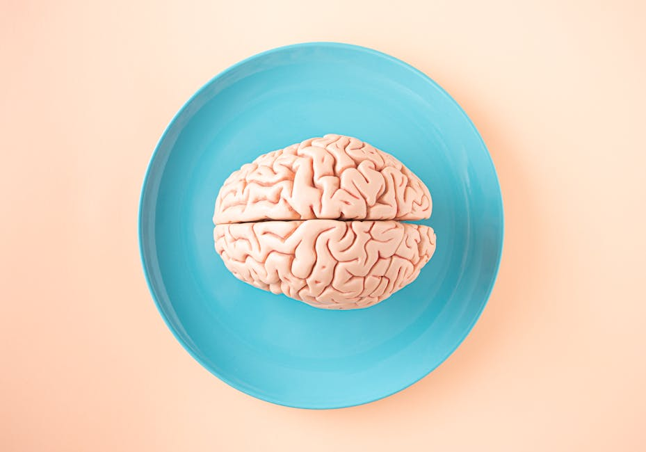

{fig-alt="A stylized rendering of a brain made of light."}

On a Tuesday afternoon in November 2018, a series of bots was collecting data for a dissertation. Their target was nearly 1,700 Twitch channels. Most of the channels they were monitoring were playing video games. League of Legends, World of Warcraft, Rocket League, Hand Simulator. One of the channels was streaming under the category of Art. This streamer was Bob Ross, a man who had been dead since 1995, painting happy little trees in a public-television loop. Across that week Bob Ross averaged 3,178 concurrent viewers inside the collection. xQc, a variety streamer with the highest chat volume in the collection, averaged 17,363. Both appeared on the same platform, in the same week, drawing very different audiences in very different ways.

Here is the move a social scientist makes. Stare at those two numbers and ask not what they mean, but what they are. They are **data**. Specifically, they are summaries derived from 590,876 stream snapshots collected by an automated process during five and a half days of public broadcasting on Twitch. A snapshot is a single row in a database, six columns wide: channel name, stream title, game category, viewer count, timestamp, and a primary key. Multiply that row by half a million and you have a **corpus**, a body of evidence that licenses some questions and refuses others.

The first pages of a methods textbook are usually where the author tries to convince you that what comes next will be more interesting than it sounds. This book is going to try a different move. The biggest gap in students starting a research methods course is not motivational. It is conceptual. Students who are perfectly comfortable saying "I have data" rarely have a precise account of what data is, where it came from, or what claims it would actually let them make. Half a million stream snapshots is data. So is one student's interview about why she watches Bob Ross. So is a coded transcript. So are seven judges' ratings of a song's emotional valence in a music study from 2008. Data is, broadly, what you collected on purpose because you wanted to be able to defend a claim later. This book teaches you to collect data on purpose, work with it carefully, and defend the claims you build from it.

The skills are portable. The same logic that asks whether gaming streams attract different chat than non-gaming streams also asks whether news framing shapes public opinion, whether ad exposure changes purchase behavior, whether social media use correlates with political polarization. Methods do not belong to a topic. They belong to a way of thinking. The Twitch dataset is the vehicle. The destination is methodological literacy.

## Why we tell stories (and why that matters for science)

The neuroscientist Lisa Feldman Barrett has spent her career dismantling the idea that the brain passively receives information about the world. In *How Emotions Are Made* (Barrett, 2017a), she argues that the brain is fundamentally a prediction machine. It generates models of reality, tests those models against incoming sensory data, and updates its beliefs when its predictions fail. Her theory of constructed emotion proposes that this prediction-error cycle is not a metaphor for the scientific method. It is the cognitive substrate of how minds work (Barrett, 2017b). We are, at a neurological level, hypothesis-testing organisms.

Will Storr, in *The Science of Storytelling* (Storr, 2019), pushes the same framework toward narrative. Stories emerged, he argues, as cognitive tools for managing social complexity. They model cause and effect, simulate outcomes, and let groups coordinate behavior around shared beliefs. When the predictions inside a story fail, we experience cognitive dissonance. The resolution is either changing the story or denying the evidence.

This reframes what research does. We tend to think of science as the opposite of storytelling. Cold. Objective. Stripped of human subjectivity. But the brain does not toggle between "creative mode" and "analytical mode." It runs the same narrative machinery for both. The difference is not in the architecture. It is in the rigor applied to testing the story, and in the public record of evidence that backs it up. Stories without data are anecdotes. Data without stories is a spreadsheet. Research is the discipline of building one out of the other.

## The limits of everyday knowing

Before formalizing what that discipline looks like, it is worth being honest about how we usually make sense of the world. Earl Babbie (2021) identifies several common ways of knowing that work well enough for daily navigation but break down when the stakes demand evidence others can trust.

**Tradition** is what we have always done. It offers stability and continuity. It also resists updating, and it often rests on nothing more than "this is how it's done."

**Authority** defers to experts or institutions. This is efficient, often necessary. It is also only as reliable as the expertise itself, which can be misapplied, biased, or compromised by interest.

**Common sense** feels self-evidently true. It is also culturally bound and frequently contradictory ("look before you leap," "he who hesitates is lost").

**Intuition** is fast and sometimes insightful, drawing on accumulated experience. It is also shaped by cognitive biases, emotional states, and the availability of recent examples.

These shortcuts are fine for navigating Tuesday. They become problems when we try to build knowledge that others should trust. Public health messaging during the COVID-19 pandemic leaned on authority (government agencies), tradition (past pandemic playbooks), and common sense ("wash your hands"). The underlying scientific questions about transmission, mitigation, and vaccine efficacy demanded systematic testing that sometimes contradicted all three.

Research offers a more disciplined alternative. Not because researchers are smarter or less biased, but because the process itself is designed to expose biases to scrutiny.

## The sacred flaw

Storr (2019) identifies a recurring element in compelling narratives: the **sacred flaw**. This is a deeply held but mistaken belief the protagonist clings to even as evidence mounts against it. The story's tension arises from the inevitable collision between false certainty and reality.

The **null hypothesis** plays this role in research. It is the default story: nothing interesting is happening here. Any pattern you think you see is random noise. The researcher's task is to accumulate evidence so overwhelming that maintaining the null hypothesis becomes untenable. When we "reject the null," we are forcing the data to tell a different story, one that contradicts what we initially assumed.

This framing turns statistical significance from an abstract threshold into a narrative device. A **p-value** of 0.001 does not just mean "statistically unlikely under the null." It means the old story is so incompatible with the evidence that clinging to it requires willful blindness.

Sometimes the move runs in the other direction, and an established story turns out to be the wrong one. The economists Carmen Reinhart and Kenneth Rogoff published a 2010 paper called "Growth in a Time of Debt," which argued that countries whose public debt exceeded 90 percent of GDP grew significantly more slowly than countries below that threshold. The finding became a foundational reference for austerity policy across Europe and the United States. In 2013, a third-year doctoral student at UMass-Amherst named Thomas Herndon tried to replicate the analysis for a class assignment. He could not get the numbers to come out the same way. When he eventually persuaded Reinhart and Rogoff to share their original spreadsheet, he found an Excel formula that had excluded several countries from the average. With the formula corrected, average growth above the 90 percent debt threshold turned out to be 2.2 percent, not the negative 0.1 percent the original paper had reported (Herndon, Ash, & Pollin, 2014). The cliff disappeared because there was no cliff.

That is a worked example of the discipline. The original paper was not fabricated. It was published, peer-reviewed, and cited in policy debates. It was also wrong, in a way that only became visible when someone took the data seriously enough to ask for the file. Failure of this kind is not a sign that research does not work. It is a sign that it does. The mechanism for catching the error is built into the architecture, and the error gets caught when researchers document their work transparently enough for someone else to retrace it.

Take the Twitch puzzle from a moment ago. The null hypothesis is that there is no systematic relationship between what is on the screen (gaming versus painting) and what happens in the chat. The viewers are different sizes, sure. But the conversation might look identical. Same emote frequency. Same message length. Same patterns of who talks and how often. The null says: you noticed something. That is not yet evidence. The chapters that follow walk through what it takes to move from that hunch to a defensible claim.

## Mapping narrative onto research design

If research is the disciplined work of testing a story against evidence, the components of a study map onto the components of a story. They do, with surprising precision.

### Inciting incident: the research problem

Every story begins with disruption. The protagonist's stable world encounters something it cannot fit, and the disruption demands a response. In research, the inciting incident is an **anomaly**, an observation that does not square with existing explanations.

In the Twitch data, the inciting incident might be the Bob Ross puzzle. It might be the fact that loltyler1, a League of Legends streamer, peaked at 78,340 concurrent viewers during one stream that week while giantwaffle, a Rocket League streamer with a steady audience, topped out at 11,119. It might be something more granular: a single message in the chat log that seems out of place, a sudden spike in conversation rate, a pattern of named-streamer references that look like they are addressed to no one in particular.

Inciting incidents work the same way across the social sciences. A political scientist notices that voter turnout rose in a district despite reduced campaign spending. A public relations scholar observes that a corporate apology went viral and made the brand worse. An advertising researcher finds that a product placement in a low-budget show outperformed one in a prestige drama. Each anomaly opens a gap between observation and explanation, and that gap is where the research lives.

::: {.graduate-extension}
**What distinguishes a scholarly contribution.** Research methods can be understood as disciplined storytelling: you have a claim, you gather evidence, you tell the story the data supports. Graduate-level work adds a second obligation, that your story must be reproducible, falsifiable, and positioned within a cumulative scholarly conversation. A scholarly contribution in communication research does one of four things: (1) tests a theory in a new context; (2) replicates a finding using new data; (3) resolves a conflicting finding in the literature; or (4) introduces a testable theoretical construct. Before beginning any V2V study at the graduate level, identify which of these your project accomplishes. If you cannot answer precisely, the research question is not yet graduate-level. For your own study, ask which of the four contribution types your current research question best fits, and what you would need to change for it to fit more precisely.
:::

### Protagonist: the researcher as detective

In detective fiction, the detective gathers clues, formulates theories, and tests them against evidence. The researcher does the same work. The parallel is not accidental. Both are doing **abductive reasoning**, working backward from observation to the most plausible explanation. Like a detective, the researcher must stay skeptical of convenient narratives and willing to revise theories when the evidence pushes back. The integrity of the investigation depends on this.

### Antagonist: confounds, bias, and noise

The antagonist in research is not a person. It is the disorder that obscures truth. **Confounding variables** muddy causal claims. **Sampling bias** makes findings ungeneralizable. **Measurement error** introduces noise. These are not malicious forces. They are the texture of working with messy, real-world data. They function narratively as obstacles the researcher has to overcome through deliberate design.

### Rising action: literature review and theory

Before confronting the antagonist, the protagonist needs preparation. The **literature review** is that preparation. Previous studies show what is already known, where the gaps are, and which methods have succeeded or failed. **Theory** provides the conceptual frame, the lens through which findings are interpreted and hypotheses generated.

For a Twitch study, the literature you would turn to first is **uses and gratifications theory** (Katz, Blumler, & Gurevitch, 1973), which proposes that people actively choose media to satisfy specific psychological needs. If livestream chat is meeting needs for connection, performance, or community, those needs should show up in the messages themselves. Chapter 5 walks through how a theory like uses and gratifications gets turned from a paragraph in a journal article into a one-page worksheet that points at columns in a database.

### Climax: data analysis

The climax is the moment when the setup pays off. In research, this is the **statistical test**, the point where the accumulated evidence either supports the hypothesis or does not. Everything has led here: the question, the sample, the codebook. Now the analysis runs and the data return a verdict.

### Falling action: interpretation and limitations

After the climax, the detective explains what the evidence reveals and acknowledges what is still uncertain. The **discussion section** does the same work. What do the findings mean? Where do they fit in the broader literature? What alternative explanations might still hold? What questions remain open? This is where intellectual honesty becomes the load-bearing virtue. Every study has limits: sample size, measurement precision, generalizability. Acknowledging those limits does not weaken the research. It strengthens it, by showing that the researcher understands the boundary of the claim.

### Resolution: implications and future research

A story concludes by showing how the world has changed in light of what we have learned. The **implications section** does this for research. Why do the findings matter? To practitioners, to policymakers, to future scholars. The narrative may be complete, but it opens threads for someone else to pull.

## Anecdote and data: complementary, not oppositional

Mass communication students are skilled storytellers. You know how to find a compelling anecdote, conduct an interview, build a narrative that moves an audience. That is journalism, and it is valuable. But journalism and science do different epistemic work.

**Journalism** makes the abstract concrete. It humanizes statistics, gives texture to trends, and makes audiences care by showing impact on individual lives. A profile of a single Twitch streamer who built a community out of isolation is far more emotionally resonant than a p-value.

**Science** establishes generalizability. It asks whether the pattern observed in one case holds across many. It quantifies relationships, controls for confounds, and builds evidence that holds up under skeptical scrutiny.

The tension is productive. Anecdotes generate hypotheses. Data test them. Data identify patterns. Anecdotes explain why those patterns matter. A complete research report uses quantitative findings to establish that the pattern is real and qualitative examples to illustrate what the pattern looks like in practice. The mistake is treating one as a substitute for the other. A moving interview with a Twitch viewer does not prove that a million others had the same experience. A statistically significant finding without human context risks being true and unpersuasive. The best social science holds both in tension.

## What this book teaches

The course gives you a chance to do original research on a real dataset. The dataset is a single week of Twitch chat and stream snapshots collected between November 18 and November 24, 2018. The raw corpus contains 21,964,296 chat messages from 1,695 channels, plus 590,876 snapshots of who was streaming what game to how many people.

That raw corpus is going to play three different roles depending on the question being asked, and the difference between those roles is one of the easiest things to lose track of. The **population** is the 1,690 channels that show up in both the chat log and the stream log during the collection window: every channel that could in principle be analyzed end to end. The **working corpus** is a 50-channel subset stratified by chat volume so that the head, the middle, and the long tail of Twitch are all represented in the sample students actually load into R. The **anchor set** is eight channels inside that 50 (xqcow, forsen, sodapoppin, asmongold, loltyler1, disguisedtoast, giantwaffle, and bobross) that recur as named examples throughout the rest of the book. Bob Ross from a moment ago is one of the anchors. xQc is another.

Population, sample, and exemplar are not interchangeable. A descriptive claim about Twitch in November 2018 has to be defended at the population level. A statistical pattern observed in a sample has to be argued back up to the population it was drawn from. An exemplar like Bob Ross illustrates a phenomenon without proving it. Most of the trouble students get into in their first research project comes from sliding between these three roles without noticing. The book returns to the distinction in every part.

The dataset is a means, not an end. The book studies Twitch not because Twitch is the only thing worth studying, but because it provides a rich, accessible, genuinely interesting sandbox for learning how social science actually works. Every method you apply here transfers to any other content domain. The student who codes Twitch messages as "directed at the streamer" or "broadcast to the room" using a reliable codebook has also learned to code news frames as "episodic" or "thematic," to classify advertising appeals as "emotional" or "rational," to categorize social media posts as "civil" or "uncivil."

The data license a range of research questions:

- Does chat behavior differ in gaming versus non-gaming streams? Are messages longer, more emote-dense, more directed at the streamer?
- Do bigger audiences produce different chat than smaller ones, or is the per-viewer rate of conversation roughly stable across audience size?
- Does the language viewers use to address a streamer change in moments when the audience is climbing versus when it is falling?
- What does a "regular" of a Twitch channel look like in the data, and how often do the same usernames appear across multiple streams?

A caveat the data itself enforces: five and a half days is not a long time. Questions about how audiences evolve over months or years cannot be answered here. Questions about what was happening on Twitch during that specific window, and what the chat looked like inside it, are well supported. Working within the limits of your data is itself a methodological skill, and Chapter 11 returns to it directly.

The book is organized around the research process itself, divided into five parts that mirror the narrative arc this chapter has been describing.

**Part I: Foundations (Chapters 1 to 3)** sets up the intellectual and technical infrastructure. You will build habits of mind and workflow, plus the reproducibility principles that distinguish rigorous research from improvised analysis. Chapter 3 takes up research ethics, the constraint that all subsequent work has to honor.

**Part II: Planning (Chapters 4 to 6)** is where you design the study. Literature review, theoretical framework, research questions, and a project prospectus that maps what you will study, why it matters, and how you will proceed.

**Part III: Operationalization (Chapters 7 to 9)** is where you turn vague constructs into measurable variables. Sustained observation of the data, the move from qualitative noticing to quantitative coding, the construction of a codebook, and a first hands-on session with R. The book teaches content analysis end to end because depth in one method serves you better than shallow coverage of four, but it does not pretend the other major social-science methods (surveys, experiments, qualitative interviews and focus groups) do not exist. Chapter 5 introduces them as a coherent set when it discusses how theory selection shapes method choice. Chapter 9 stays focused on the first-R-contact work that the rest of the lab depends on. The V2V Hub holds the deeper hands-on material for any of these methods you want to pursue.

**Part IV: Execution (Chapters 10 to 12)** is the work itself. Sampling, inter-coder reliability, data wrangling, descriptive statistics, visualization. The chapters where you spend the most time in the IDE.

**Part V: Inference and publication (Chapters 13 to 14)** is the closing arc. You run inferential tests, interpret what they mean, and publish a portfolio that integrates the whole project into a single reproducible document.

A small note on tooling, taken up properly in Chapter 2. This book teaches the canonical version of each task. The companion V2V Hub teaches the practical version, including how to use AI assistants like GitHub Copilot to do parts of the work faster. The textbook focuses on what the discipline expects you to understand. The Hub focuses on how to execute that understanding in 2026, when an AI assistant is going to be sitting next to your cursor whether or not anyone teaches you what to do with it.

## A note on paradigms

This chapter has presented research through a social scientific lens: formulate hypotheses, test them against data, revise the story based on evidence. This is one way of knowing. It is the primary approach of this book. It is not the only legitimate one.

**Interpretive** researchers argue that human experience is too complex for hypothesis testing. They seek to understand how people make meaning, using methods like interviews, focus groups, and ethnography. **Critical** researchers argue that research should expose and challenge power structures, not just describe patterns. Both **paradigms** have produced foundational insights in communication and media studies.

Chapter 5 explores these paradigms in more depth. For now, the thing to recognize is that the social scientific approach is a choice. A productive and powerful one. But one of several. The ability to understand and evaluate research from all three paradigms is what separates a methodologically literate scholar from a technician who can run statistical tests but cannot think critically about what those tests mean.

::: {.graduate-extension}
**The four pillars of graduate-level practice.** The rest of this book introduces four practices central to graduate-level V2V work: (1) *a priori power analysis* — committing to a sample size before data collection; (2) *pre-registration* — committing to hypotheses, measures, and analysis plan before collection; (3) *two-coder reliability* — verifying that your codebook produces consistent results regardless of who applies it; and (4) *audit trail* — keeping a version-controlled record of every transformation from raw data to published figure. These are not optional add-ons. They are entailments of a post-positivist epistemological commitment. Munafo et al. (2017) describe a "garden of forking paths" in which researcher degrees of freedom inflate false-positive rates; for your own study, ask where in the V2V workflow this risk appears first, and how pre-registration addresses it.
:::

## Looking ahead

Chapter 2 turns to the technical infrastructure that makes research reproducible. VSCode, R, Quarto, Git. Those tools can look intimidating from a distance. Their purpose is simple: they let you document every step of an analysis so others, including your future self, can verify and build on it. Chapter 2 also brings you face to face with the dataset for the first time. Ten rows of a real collection from a single minute in November 2018, before any cleaning, before any code. The questions you ask of those ten rows are the questions the rest of the book will help you answer at scale.

## References

Babbie, E. R. (2021). *The practice of social research* (15th ed.). Cengage Learning.

Barrett, L. F. (2017a). *How emotions are made: The secret life of the brain*. Houghton Mifflin Harcourt.

Barrett, L. F. (2017b). The theory of constructed emotion: An active inference account of interoception and categorization. *Social Cognitive and Affective Neuroscience*, *12*(1), 1-23. https://doi.org/10.1093/scan/nsw154

Herndon, T., Ash, M., & Pollin, R. (2014). Does high public debt consistently stifle economic growth? A critique of Reinhart and Rogoff. *Cambridge Journal of Economics*, *38*(2), 257-279. https://doi.org/10.1093/cje/bet075

Katz, E., Blumler, J. G., & Gurevitch, M. (1973). Uses and gratifications research. *Public Opinion Quarterly*, *37*(4), 509-523. https://doi.org/10.1086/268109

Reinhart, C. M., & Rogoff, K. S. (2010). Growth in a time of debt. *American Economic Review*, *100*(2), 573-578. https://doi.org/10.1257/aer.100.2.573

Storr, W. (2019). *The science of storytelling: Why stories make us human, and how to tell them better*. William Collins.

::: {.graduate-extension}
### Graduate readings

Munafo, M. R., Nosek, B. A., Bishop, D. V. M., Button, K. S., Chambers, C. D., Percie du Sert, N., Simonsohn, U., Wagenmakers, E.-J., Ware, J. J., & Ioannidis, J. P. A. (2017). A manifesto for reproducible science. *Nature Human Behaviour*, *1*, 0021. https://doi.org/10.1038/s41562-016-0021
:::

