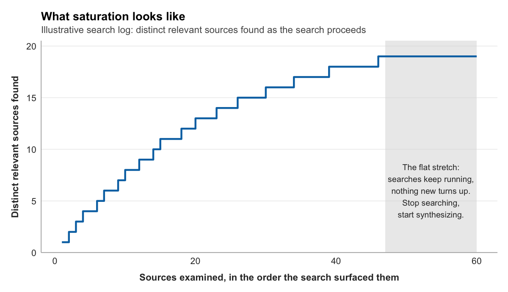

{fig-alt="A stylized rendering of layered document forms suggesting an archive."}

There is a moment in every research project when you realize the literature is deeper than you thought. You find an article that seems directly relevant to your question. It cites twelve other articles. You track down three of those, and each cites fifteen more. Within an hour you have accumulated thirty sources you should probably read, and the prospect of making sense of them all feels paralyzing.

The instinct at this point is to retreat: narrow the scope, focus on a handful of recent articles, and hope that is sufficient. The instinct is understandable and it is wrong. It misunderstands what a **literature review** actually does. A literature review is not a checklist where you demonstrate you have read enough articles. It is a map of intellectual territory, and you cannot map territory by looking at three landmarks and declaring the job done.

The challenge is not just finding sources but finding them systematically, documenting the search so that someone else could repeat it, and knowing when you have read enough to claim with confidence that you understand the landscape. This chapter introduces the **archivist mindset**: the discipline of searching, organizing, and synthesizing scholarship as active cartography rather than passive consumption.

These skills are not specific to any one topic. Whether you are mapping the literature on livestream viewer motivation, news framing and public opinion, health communication campaigns, or algorithmic bias in social media, the process is identical. Search, organize, synthesize, identify the gap.

## The conversation metaphor

Imagine walking into a room where a complex debate has been unfolding for years. The participants are knowledgeable, passionate, and deeply invested. They have built on each other's arguments, challenged assumptions, introduced new evidence, and staked out positions. You have something you want to contribute, an observation you think matters.

If you simply blurt it out without first listening to what has already been said, your contribution will likely be ignored or dismissed as naive. You might be repeating a point made a decade ago. You might be unaware that someone already tested your idea and found it wanting. You might be using terminology in ways that signal you have not done the intellectual work of understanding the debate's history.

To contribute meaningfully, you must first listen. You must understand who the key voices are, what the major points of contention are, where consensus exists, and what questions remain unresolved.

This is what a literature review does. It is the disciplined act of listening to the scholarly conversation before adding your voice to it. And it is not optional. No research project exists in a vacuum. Every study is part of an ongoing dialogue that has been unfolding in journals, books, and conference presentations for years, sometimes decades. The literature review is how you earn the right to ask your question.

## What a literature review accomplishes

A strong literature review does several things at once.

**It situates your work.** The review demonstrates that you are aware of the broader context and not working in isolation. By connecting your research to established theories and previous findings, you show how your study fits into, and extends, the collective knowledge of the field. This is partly defensive: reviewers and instructors want to know you have done your homework. It is also generative, because seeing how your question connects to existing work often reveals angles you had not considered.

**It identifies a gap.** Perhaps the most critical function of the review is justifying why your study is necessary, which requires identifying a gap in existing scholarship. By demonstrating a gap, the review answers the "so what?" question. It persuades the reader that your study is not redundant.

**It prevents reinventing the wheel.** A thorough review ensures you are not proposing a study that has already been done. It is frustrating to develop what feels like an original idea only to discover it was the subject of a dissertation five years ago.

**It provides methodological guidance.** Beyond findings, the literature offers a wealth of methodological knowledge: validated measurement tools, successful sampling strategies, analytical techniques. You can also learn from others' limitations. Content analysis handbooks such as Krippendorff (2018) and Neuendorf (2017) are particularly valuable here, because they compile decades of best practice for coding, sampling, and reliability.

**It refines your research question.** Engaging with the literature sharpens a broad interest into a precise, researchable question. You might start with a vague curiosity about "Twitch chat" and, through reading, discover a specific debate about whether viewer engagement is driven by the content on the screen or the social environment around it. The literature provides the concepts, terminology, and frameworks that let you ask a question that is not just interesting but empirically tractable.

::: {.graduate-extension}
**The quantitative function of the literature review.** Beyond surveying what is known to identify a gap, the literature review has a further function: *effect size extraction*. Before you can calculate the sample size you need (Chapter 6), you need a defensible estimate of the effect size you expect to find. The most defensible source is prior published research. When you read a study using a similar design, extract its effect size (Cohen's *d*, Cramer's *V*, correlation *r*) and note the sample size the authors used. These numbers become the inputs for your power analysis. A literature review that cannot supply effect size estimates has not finished its job. To practice, choose a published V2V-style study, extract its primary effect size, determine whether the authors provided a power analysis, and use the `pwr` package to calculate the sample size required to detect that effect at 80% power; then work out what you would do when no prior studies report an effect size for your specific research question, describing two defensible strategies for justifying a sample size in that case.
:::

## The search process

Searching for literature happens in phases. Early on you are exploring, trying to get a sense of the terrain. Later you are systematizing, making sure you have found the relevant work and can defend your search strategy to a skeptic.

### Phase one: exploratory searching

Start broad. You are trying to answer basic questions. What terms do scholars use to discuss this topic? Who are the key researchers? What journals publish this kind of work? What theories are commonly invoked?

Google Scholar is the place to start. It is less comprehensive than specialized databases, but it is fast, free, and good for getting oriented. Wikipedia, despite not being a citable source, is useful for finding terminology and key concepts; scroll to the references section of a relevant article and follow the citations to actual scholarship. And the reference list of any good article you find is itself a map: the sources an author cites repeatedly are likely foundational works.

At this stage, do not worry about perfect organization. Collect promising sources in **Zotero**, the open-source reference manager this course uses, and tag them liberally.

### Phase two: systematic searching

Once you have a sense of the landscape, shift to systematic searching. The goal now is comprehensiveness.

Use academic databases. Communication & Mass Media Complete is the primary database for communication research. PsycINFO is essential if your question touches psychology: emotion, persuasion, cognition, attitudes. Web of Science and Scopus are multidisciplinary databases useful for citation tracking.

Inside those databases, use **Boolean operators** to build precise search strings. AND narrows results, because both terms must appear. OR expands them, because either term can appear. NOT excludes unwanted results. An asterisk is a wildcard that captures variations: `stream*` finds stream, streams, streaming, and streamer.

A search string for livestreaming viewer research might look like this:

```
(livestream* OR "live streaming" OR Twitch) AND
(motivation* OR gratification* OR engagement) AND
(viewer* OR audience* OR chat)
```

Document every search in a plain-text search log: the date, the database, the exact search string, the limiters you applied, the number of results, and how many you kept. The log serves two purposes. It lets you defend your search strategy later, and it helps you refine searches by showing what worked and what did not.

::: {.graduate-extension}
**Systematic search over ad hoc search.** Ad hoc searches — "I Googled it and found relevant papers" — cannot support power analysis inputs, because you do not know whether the studies you found are representative of the literature. A systematic search uses predefined databases (Communication Abstracts, Web of Science, PsycINFO), predefined search strings, and documented inclusion/exclusion criteria. The search process is itself a methods disclosure: you report it alongside the analysis so that a future researcher can reproduce and update your review.
:::

### Phase three: citation chaining

Once you have identified a few highly relevant articles, the keystone articles, use **citation chaining** to map the scholarly network.

**Backward chaining** means looking at the references cited in a keystone article. These are the foundational works the author built on. **Forward chaining** means using Google Scholar's "Cited by" feature to see which newer articles have cited the keystone. This reveals how the conversation has evolved since the keystone was published.

The process creates a snowball effect. One key article leads to ten more, which lead to twenty more. But the growth is strategic, not random. You are following the citation network outward from the work that matters most.

## Recognizing saturation

At some point, new searches yield diminishing returns. You are finding articles that cite the same foundational works you have already read. The arguments sound familiar. The methods are variations on approaches you have seen.

This is **saturation**, the point where additional searching is unlikely to change your understanding of the literature. Saturation does not mean you have read everything, which is impossible. It means you have read enough to identify the major theories, recognize the key debates, understand the common methodological approaches, and articulate what is known and what is still uncertain.

Practically, saturation looks like three consecutive database searches turning up zero new relevant articles, new articles citing the same eight to ten foundational sources you have already read, and an ability to predict what an article will say from its title and abstract. When you reach that point, stop searching and start synthesizing.

{fig-alt="A step curve of distinct relevant sources found as a search examines sixty sources in order, built from an illustrative search log rather than real data. The curve climbs quickly through the first twenty sources, slows through the thirties, and goes completely flat after source forty-six: a shaded band marks the flat stretch where searches keep running but nothing new turns up, which is the point to stop searching and start synthesizing."}

## Identifying research gaps

A research gap is not just "something no one has studied." It is a space where inquiry is justified, where the absence of knowledge creates a problem or where contradictions demand resolution. Gaps come in several forms.

A **topical void** is a phenomenon, population, or context no one has studied. There is substantial research on why people watch livestreams, for example, but less that examines how chat behavior itself differs between gaming and non-gaming streams. Be cautious here: what seems novel to you might be covered under different terminology, and thorough searching is the guard against claiming novelty where none exists.

A **methodological gap** exists when a phenomenon has been studied, but with methods that have important limitations. Most livestreaming motivation research relies on self-report surveys, which capture what viewers say motivates them. Behavioral trace data, like the contents of a chat log, could reveal whether what viewers do matches what they say.

A **contradiction** exists when previous studies have produced conflicting findings and your study aims to resolve the inconsistency. Two well-designed studies reaching opposite conclusions is not something to be embarrassed about reporting. It is an opening.

A **theoretical gap** exists when existing work explains a phenomenon through one lens and you believe another lens would be more illuminating. If most research on livestream engagement uses uses-and-gratifications theory, a parasocial-interaction framework (Horton & Wohl, 1956) might explain a part of the picture the dominant lens leaves dark.

## Articulating the gap

When you write the literature review, the gap becomes the hinge of the argument. The structure is consistent regardless of topic:

1. **Establish what is known.** Summarize existing research to show you understand the conversation.
2. **Identify the limitation.** Point out what is missing, contradictory, or inadequately explained.
3. **Argue for your study.** Show how your research addresses that gap.

Known, then limitation, then what this study does. A student studying livestreaming would use different citations than a student studying news framing, but both follow the same logic: research has established X, however most studies share limitation Y, this study addresses that gap by doing Z.

## Organizing sources: the literature map

By now you have dozens of sources in Zotero. The challenge is making sense of them, not as individual articles but as a coherent body of knowledge.

A **literature map** is a document that organizes sources by theme rather than chronologically or alphabetically. Create it as a markdown file in your project, with a heading for each theme and the relevant sources listed beneath it. A literature map for livestreaming research might have a theme for viewer motivations, a theme for community and social dynamics, a theme for the streamer's labor and performance, a theme for content analysis methods, and a running section for the gaps you have identified.

The map does three things. It shows you at a glance which themes are well covered and which are sparse. It forces you to think about how sources relate, which is the beginning of synthesis. And its structure often becomes the structure of your written literature review.

## Synthesis, not summary

A weak literature review reads like a list:

> Hamilton, Garretson, and Kerne (2014) studied Twitch as a participatory community. Sjöblom and Hamari (2017) examined viewer motivations. Hilvert-Bruce and colleagues (2018) studied social motivations for engagement.

Three disconnected summaries. The reader learns what each study was about but not how the studies fit together.

A strong literature review reads like an argument:

> Researchers have converged on a counterintuitive finding: livestream viewing is motivated less by the content on the screen than by the social experience around it. Hamilton, Garretson, and Kerne (2014), in an ethnographic study, characterized Twitch streams as virtual third places, venues where informal communities form and socialize rather than broadcasts to be passively consumed. Sjöblom and Hamari (2017) put this to a survey test: studying Twitch users through a uses-and-gratifications framework, they found that social and tension-release motivations were central to why people watched. Hilvert-Bruce, Neill, Sjöblom, and Hamari (2018) extended the finding to engagement specifically, showing that social interaction and a sense of community predicted not just watching but chatting, subscribing, and returning. They also found something this course can investigate directly: viewers of smaller channels were more socially motivated than viewers of large ones. Taken together, this body of work suggests that the chat box, not the gameplay, may be where the most important activity on a livestream happens. However, these studies rely almost entirely on self-report surveys, which capture what viewers say motivates them rather than what they actually do. Whether the behavioral traces left in a chat log would corroborate the survey findings remains largely unexamined.

The second version groups sources by theme, identifies the convergence among them, adds nuance, names a methodological limitation they share, and points toward a gap. That is what a literature review demands: not reporting what others found, but constructing an interpretation of the collective evidence. Notice, too, where the gap in that example points. It points directly at the kind of study this course has you do, a content analysis of a real chat log.

## A minimum viable literature review

If the synthesis above feels intimidating, start smaller. A defensible first pass needs only three sources and four sentences.

1. Source A, one sentence. What did this study find?
2. Source B, one sentence. What did this study find?
3. Source C, one sentence. What did this study find?
4. The gap, one sentence. What do these three sources, together, leave unexplored that your study could address?

A worked example using three livestreaming sources:

> Hamilton, Garretson, and Kerne (2014) characterized Twitch streams as virtual third places where informal communities form. Sjöblom and Hamari (2017) found that social and tension-release motivations were central to why people watch on Twitch. Hilvert-Bruce, Neill, Sjöblom, and Hamari (2018) extended this to show that social interaction predicted not just watching but chatting and subscribing. All three studies rely on self-report surveys, leaving the question of whether the same patterns are visible in behavioral chat-log data largely unexamined.

Four sentences, three citations, one gap. That is enough to anchor a prospectus. The synthesis paragraph in the previous section is what this minimum version grows into after another round of reading. It is not the starting point.

## The ethics of citation

Citation is not bureaucratic. It is ethical. When you use someone else's idea, method, or finding, you credit them. This holds even when you are paraphrasing rather than quoting directly.

Specific empirical findings require citation. Theoretical concepts require citation. Methodological approaches require citation. Direct quotes always require citation. Paraphrased ideas require citation unless they are common knowledge in the field. What does not require citation is genuine common knowledge ("Twitch is a livestreaming platform"), your own original interpretations, and your own data and analysis.

When in doubt, cite. Over-citation is rarely criticized. Under-citation damages credibility, and in its more serious forms it is plagiarism, which Chapter 3's discussion of research integrity treats as the breach of trust that it is.

## Looking ahead

Chapter 5 takes up theory. A literature review tells you what the scholarly conversation has established. A theoretical framework gives you the lens you will use to interpret your own findings. Chapter 5 also addresses how the choice of theory shapes the choice of method, and introduces the major social-science methods as a coherent set, so that committing to content analysis for this course is a decision made with the alternatives in view.

## References

Hamilton, W. A., Garretson, O., & Kerne, A. (2014). Streaming on Twitch: Fostering participatory communities of play within live mixed media. In *Proceedings of the 32nd ACM SIGCHI Conference on Human Factors in Computing Systems* (pp. 1315-1324). Association for Computing Machinery. https://doi.org/10.1145/2556288.2557048

Hilvert-Bruce, Z., Neill, J. T., Sjöblom, M., & Hamari, J. (2018). Social motivations of live-streaming viewer engagement on Twitch. *Computers in Human Behavior*, *84*, 58-67. https://doi.org/10.1016/j.chb.2018.02.013

Horton, D., & Wohl, R. R. (1956). Mass communication and para-social interaction: Observations on intimacy at a distance. *Psychiatry*, *19*(3), 215-229. https://doi.org/10.1080/00332747.1956.11023049

Krippendorff, K. (2018). *Content analysis: An introduction to its methodology* (4th ed.). SAGE Publications.

Neuendorf, K. A. (2017). *The content analysis guidebook* (2nd ed.). SAGE Publications.

Sjöblom, M., & Hamari, J. (2017). Why do people watch others play video games? An empirical study on the motivations of Twitch users. *Computers in Human Behavior*, *75*, 985-996. https://doi.org/10.1016/j.chb.2016.10.019

::: {.graduate-extension}
### Graduate readings

Cooper, H., Hedges, L. V., & Valentine, J. C. (Eds.). (2019). *The handbook of research synthesis and meta-analysis* (3rd ed.). Russell Sage Foundation.
:::

