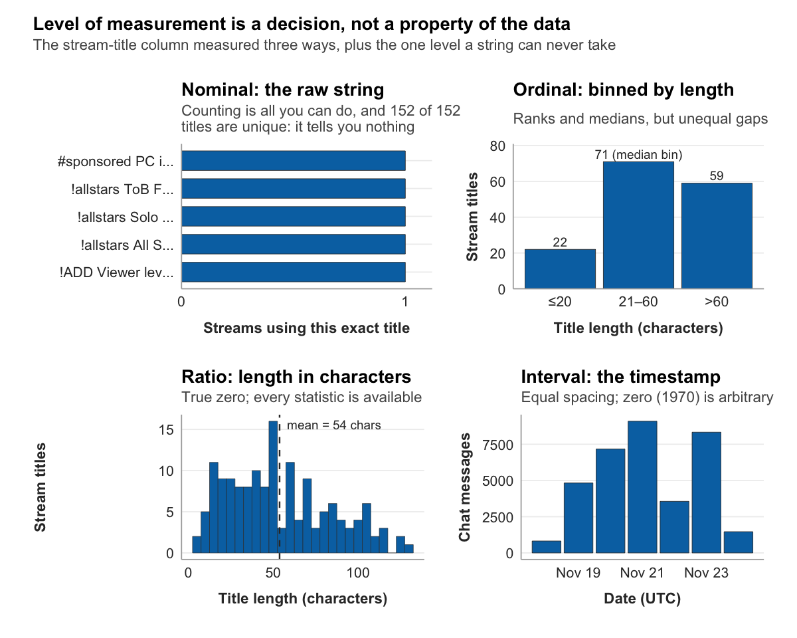

---
title: "Chapter 8: From vibes to variables"
---

{fig-alt="A stylized rendering of measuring instruments and gauges."}

Somewhere in the field-notes document you built in Chapter 7 is an entry like this one: "Chat in the art stream felt calmer and more conversational than chat in the gaming stream. People talked to each other, not just to the streamer." That sentence is a real observation. You earned it by watching. It is also, as written, useless to a coder.

"Calmer" is not a category anyone else can apply. "More conversational" is not something you can count. If you handed that field note to two people and asked them to sort a thousand chat messages by it, they would produce two different thousand-message sortings, and you would have no way to say which was right. The observation is true and the observation is unmeasurable, and the distance between those two facts is the distance this chapter closes.

The book is named for this chapter. **Operationalization** is the disciplined process of turning a vibe, a holistic and subjective impression, into a variable, an explicit and replicable measurement. It is the central methodological act of content analysis. Done well, it preserves what you noticed during immersion while making it something a stranger could measure the same way you did. Done badly, it produces numbers that look like findings and are actually artifacts. By the end of this chapter you will have a draft codebook: the document that turns your research question into a set of variables precise enough to code.

## The operationalization gap

Take the variable the running example has been circling since Chapter 6: the target of a chat message, who it is aimed at. Chapter 7's observation complicated the simple two-way split, so call the categories directed at the streamer, broadcast to the room, directed at another viewer, and unclassifiable.

A vague attempt at operationalizing this would be: "Code each message by who it is for." The problem surfaces the moment a coder meets a real message. A viewer types "same." Who is that for? A viewer types "LULW." A viewer types "no way that just happened." Each of these could plausibly be aimed at the streamer, at the room, or at another viewer, and a coder with only "code by who it is for" to go on will simply guess. Two coders will guess differently. The variable is named but not operationalized.

A better attempt specifies observable criteria. "A message is **directed at the streamer** if it contains an at-mention of the streamer's channel name, or is a second-person address ('you', 'your') that responds to something the streamer said or did in the preceding moments. It is **directed at another viewer** if it contains an at-mention of a non-streamer account, or is a reply to a specific prior message. It is **broadcast to the room** if it is a reaction or comment with no specific addressee. It is **unclassifiable** if none of these criteria settle the question." Now a coder has something to apply. The criteria are observable, the categories are defined, and two coders working from them will land in the same place far more often than two coders working from a vibe.

That is the work. Operationalization specifies, in advance and in writing, exactly what observations count as evidence for a concept. It is not unique to Twitch. A scholar coding immigration coverage must turn "this article feels sympathetic" into a defined frame variable with observable criteria. A health researcher must turn "this ad feels fear-based" into a category a coder can apply. The medium changes; the act does not.

## Conceptual and operational definitions

Every variable needs two definitions, working together.

A **conceptual definition** says what the variable means in the abstract. It draws on your reading and your theory, and it answers one question: what is this variable meant to capture? For message target, a conceptual definition might read: "The intended addressee of a chat message, reflecting whether the message functions as participation with the streamer, with the broader chat collective, or with a specific other viewer." That is clear about the idea. It is not yet a recipe.

An **operational definition** is the recipe. It says exactly what a coder does to assign a value, in enough detail that a stranger could follow it and measure the same thing you measured. The criteria in the previous section, the at-mention rule, the second-person-address rule, the reply rule, are the operational definition of message target. The conceptual definition tells you what the variable is for. The operational definition tells you what counts as evidence.

You need both, and they discipline each other. A conceptual definition with no operational definition is an idea you cannot measure. An operational definition with no conceptual definition is a procedure that has lost track of why it exists, which is how a study ends up precisely measuring something nobody wanted to know. Writing the two side by side, for every variable, is the first concrete step toward a codebook.

## How operationalization goes wrong

Four failures recur often enough to be worth naming, because naming them is the fastest way to catch them in your own work.

The first is **conflating concepts**: treating two related but distinct ideas as if they were one. A study that measures a streamer's community by counting chat messages has conflated community with activity. A large channel can have a fast chat that is also shallow and anonymous, thousands of strangers reacting in parallel and never to each other. Volume is real, but it is audience activity, not community, and the fix is to say so plainly: either defend message volume as a deliberate, narrow proxy or measure community more directly.

The second is the **unjustified proxy**: using an indirect measure without explaining why it stands in for the thing you care about. Measuring stream quality by viewer count is the standard example. Viewer count reflects discoverability, time of day, the popularity of the game being played, and a channel's existing momentum, none of which is quality. A proxy is not forbidden, but an undefended one is, and the fix is to defend it or replace it.

The third is **oversimplification**: collapsing a concept with several dimensions into a single indicator that misses most of it. Chat engagement is not only how many messages appear. It is also who is talking, whether they are talking to each other, and in what spirit. A message count captures one dimension and silently discards the rest. The fix is either to measure the other dimensions too or to state honestly that the study addresses message volume specifically, not engagement in full.

The fourth is the **unmeasurable definition**: an operational definition that cannot actually be carried out. "A message is sincere if the viewer genuinely means it" defines sincerity in terms of something no coder can observe. The fix is to operationalize through observable indicators, the surface features that, taken together, are the best available evidence for the thing you cannot see directly.

The thread running through all four is the same. An operational definition is a promise that someone else could follow your recipe and measure what you measured. Each mistake breaks that promise in a different way.

## Levels of measurement

Once a variable is operationalized, it has a **level of measurement**, and that level determines what you are later allowed to do with it. The four levels are easy to remember as **NOIR**: nominal, ordinal, interval, ratio.

The `stream_log` table is a convenient place to see all four, because its columns happen to span the range. Recall the preview from Chapter 2: channel, title, game, viewers, date.

A **nominal** variable sorts cases into categories that have no inherent order. The `game` column is nominal: Fortnite, Just Chatting, Art, Hearthstone are categories, and no arithmetic relates them. Fortnite is not greater than Art. The `channel` column is nominal too, and so, in its raw form, is `title`: a stream title is a string, and one string is not ranked above another. With a nominal variable you can count how often each category appears and identify the most common one, but you cannot average it. The average of Fortnite and Art is not a category.

An **ordinal** variable sorts cases into categories that do have an order, but where the distance between ranks is not constant. If you took stream titles and binned them by length into short, medium, and long, length-bin would be ordinal: long outranks short, but the gap from short to medium is not guaranteed to equal the gap from medium to long. With an ordinal variable you can rank cases and find the median, but the mean is not strictly meaningful.

An **interval** variable has equal, constant distances between values, but its zero point is arbitrary rather than meaning "none." The `date` column is the example, and it carries a caveat worth stating now because Chapter 11 will spend real effort on it. The dataset stores `date` as a bigint count of milliseconds since midnight on January 1, 1970. Once converted to a timestamp, it is interval-level: the distance from one minute to the next is constant across the whole column, but the zero point, 1970, does not mean "no time." It is a convention. You can meaningfully subtract two timestamps to get a duration. You cannot meaningfully say one timestamp is "twice" another.

A **ratio** variable has equal intervals and a true zero that genuinely means "none." The `viewers` column is ratio: zero viewers means no one is watching, and because that zero is real, a stream with 28,000 viewers genuinely has twice the audience of one with 14,000. Ratio variables permit the full range of arithmetic. Most counts are ratio-level: viewers, message length in characters, number of messages.

Notice what happened with stream title. As a raw string it is nominal. Measured as a character count it is ratio, because a title can have zero characters and a true zero exists. Binned into short, medium, and long it is ordinal. One column, three possible levels, depending entirely on how you operationalize it. Level of measurement is not a property the data hands you. It is a property of the decision you make.

{fig-alt="Four panels measure stream titles at different levels. Nominal: five example titles each used exactly once, because all 152 titles in the fixture are unique, so counting categories reveals nothing. Ordinal: titles binned by length into 22 short, 71 medium, and 59 long, with the medium bin holding the median. Ratio: a histogram of title length in characters with a mean of 54, where a true zero makes every statistic available. Interval: daily chat-message counts across the week, standing in for the timestamp, which has equal spacing but an arbitrary zero; a raw string can never be measured at the interval level."}

Levels matter because they govern the statistics available to you later. A nominal variable can be tested for association with a chi-square test. A ratio variable can be averaged, correlated, and entered into the kind of test Chapter 13 runs. If you operationalize an interesting variable at the nominal level when it could have been ratio, you have quietly narrowed what your study can conclude before you have coded a single case.

## Two kinds of variable

The `stream_log` columns make NOIR concrete, but they also illustrate something about where variables come from, and the distinction matters for what comes next.

Some variables arrive in the dataset ready-made. `viewers` is already a number in a column. `game` is already a category. For variables like these, the operationalization work is mostly classification: decide the level of measurement, decide whether you will use the column raw or transform it, and move on. There is no coding to do, because the platform already did it.

Other variables do not exist until you build them. Message target is not a column in `chat_log`. Nothing in the dataset records whether a message was aimed at the streamer or the room. That variable exists only after a human coder reads each message and assigns a value, and a coder can only do that consistently if you have given them a precise, written set of instructions. For variables like these, the operationalization work is most of the work, and the instructions have a name. They are a codebook.

The rest of this chapter is about the second kind. But first, the standard those instructions are built to meet.

## Reliability and validity

An operational definition can be perfectly precise and still be bad measurement. Two criteria tell you whether your measurement is any good: reliability and validity.

**Reliability** is consistency. A measure is reliable if it produces the same result under the same conditions. A bathroom scale that reads 150, then 162, then 147 as you step on and off without changing is unreliable, and its readings are worthless regardless of your actual weight. For content analysis, the form of reliability that matters most is **inter-coder reliability**: if two trained coders apply your codebook to the same messages independently, do they agree? If they do not, the codebook is not yet measuring anything stable, and no amount of analysis downstream will repair that. Inter-coder reliability is quantified with statistics, Cohen's kappa and Krippendorff's alpha among them, that correct for the agreement two coders would reach by chance alone. Chapter 10 covers those statistics and how to act on them; for now, the point is conceptual. A codebook's job is to make independent coders agree.

**Validity** is accuracy. A measure is valid if it captures the thing it claims to capture. Validity and reliability are independent. A scale calibrated ten pounds light is perfectly reliable, it reads the same every time, and perfectly invalid, it is wrong every time. The reverse can also happen: a measure can be accurate on average but so inconsistent that any single reading is unusable. Validity has several forms worth knowing by name. **Face validity** asks whether the measure looks, on inspection, like it assesses the intended concept. **Content validity** asks whether it covers all of the concept and not just a convenient slice. **Construct validity**, the most demanding, asks whether the measure behaves the way theory says it should, relating to other variables as predicted.

One principle ties the two together and is worth holding onto: reliability is necessary but not sufficient for validity. A measure that is inconsistent cannot be accurately capturing anything, so unreliability rules validity out. But a measure can be perfectly consistent and still measure the wrong thing. You need both, and you get reliability first, because a codebook is the instrument that produces it.

## The codebook

A **codebook** is the complete set of instructions for coding your data. It is not paperwork you assemble after the fact to satisfy a methods requirement. It is the instrument itself.

The most useful way to think about a codebook is as source code. If your coding process were a computer program, the codebook would be the program: it specifies every operation, handles every conditional, and ensures that two processors, here two human coders, running the same program on the same input produce the same output. Without it, you are coding from memory and intuition, and memory and intuition are exactly what reliability requires you to eliminate. Neuendorf (2017) describes the codebook as the heart of a content analysis, and the description is not decorative. The clarity of the codebook is the single strongest predictor of whether your coders will agree.

A complete codebook has five parts.

The **unit of analysis** states exactly what one coded case is. This must be unambiguous. "Code the chat" is not a unit of analysis. "The unit of analysis is a single chat message, defined as one row of the `chat_log` table: one sender, one message string, one timestamp" is. If the unit is vague, every count you later report is vague.

The **variables and their categories** list what you are measuring and what values each variable can take. For each variable you give the conceptual definition, the operational definition, every category, and a short description of each category.

The **decision rules** tell coders what to do with the cases that do not sort themselves. This is where the edge cases from your Chapter 7 observation log earn their keep. Every ambiguous case you wrote down becomes a rule.

The **examples** give two or three prototypical cases for each category, so coders have a reference for what good coding looks like and a set of cases to train on.

The **special cases** section records recurring complications. It is usually empty in a first draft and fills in as you pilot the codebook, which is Chapter 10's work.

Two principles govern the categories of any variable. They must be **exhaustive**, meaning every case can be coded, which is what the "unclassifiable" or "other" catch-all guarantees. And they must be **mutually exclusive**, meaning every case fits exactly one category. If a message can honestly be placed in two categories at once, the categories overlap, and overlap destroys reliability because two coders will split on it forever. The fix is either sharper category definitions or a decision rule that assigns precedence. A catch-all is necessary, but if more than roughly one case in ten lands in it, the category scheme is incomplete and needs work.

## A codebook for the chat study

Here is a draft codebook for the running example, the study the prospectus in Chapter 6 committed to and the observation in Chapter 7 sharpened. It has three variables, which is the floor for a workable study, and it is deliberately a draft: the special-cases section is thin because piloting has not happened yet.

> **Codebook: chat message target and form**
> **Unit of analysis.** A single chat message, defined as one row of `chat_log`: one sender, one message string, one timestamp. Each message is coded independently of the messages around it, except where a decision rule explicitly says otherwise.
>
> **Variable 1: message target.** Conceptual definition: the intended addressee of the message. Operational definition: after reading the message, the coder assigns one category. Categories: **directed at streamer** (contains an at-mention of the streamer's channel name, or is a second-person address responding to the streamer); **directed at another viewer** (contains an at-mention of a non-streamer account, or is a reply to a specific prior message); **broadcast to the room** (a reaction or comment with no specific addressee); **unclassifiable** (none of the above criteria settle the question). Level: nominal.
>
> **Variable 2: message length.** Conceptual definition: the verbal extent of the message. Operational definition: the count of characters in the message string, including spaces and emote tokens. This is a derived measure, computed rather than judged. Level: ratio.
>
> **Variable 3: contains emote.** Conceptual definition: whether the message uses Twitch's emote vocabulary. Operational definition: coded yes if the message contains at least one token from the project's emote list, no otherwise. Level: nominal.
>
> **Decision rules.** Rule 1, precedence: if a message both at-mentions the streamer and performs for the room, code it directed at streamer; the explicit address takes precedence. Rule 2, emote-only messages: a message consisting only of emote tokens is coded broadcast to the room for target unless it contains an at-mention. Rule 3, copypasta: a recognized copypasta block is coded by its content like any other message; its status as copypasta is not itself a category. Rule 4, non-English messages: code target if the addressee is determinable from at-mentions or structure; otherwise code unclassifiable. Rule 5, bot accounts: messages from known bot accounts are coded unclassifiable for target and noted for possible exclusion.

Three variables, spanning two manifest measures a coder can apply almost mechanically and one latent measure that requires real judgment, spanning nominal and ratio levels, every category exhaustive and mutually exclusive, every decision rule traceable to something observation actually turned up. That is a draft codebook. It is enough to start.

## Looking ahead

Chapter 9 is first contact with the data inside R. You have a research question, a theoretical frame, a prospectus, a field-notes document, and now a draft codebook. What you have not yet done is open the dataset in the tool you will analyze it with. Chapter 9 is where the planning stops and the code begins: you will load `chat_log` and `stream_log`, look at their structure, and confirm that the data you have designed a study around is the data you actually have.

::: {.content-visible when-profile="grad"}
::: {.callout-note title="Graduate Extension" collapse="true"}
**The formal intercoder reliability protocol.** The codebook you write in this chapter is the operational heart of your study. But a codebook that works for one coder is not necessarily a reliable instrument. At the graduate level, the codebook is not finished until a second coder has applied it to a sample of your data and the agreement has been measured and reported.

A complete V2V reliability protocol has four steps. *First*, the second coder receives the codebook — no walk-through, no hints — and codes a training set of 20–30 units independently. *Second*, the two coders compare their coding and discuss every disagreement. No new production data is coded at this stage. *Third*, the codebook is revised to add decision rules for all identified disagreements. *Fourth*, the second coder codes a fresh reliability sample (separate from the training set) independently. The agreement on this fresh sample is the κ that gets reported.

**The threshold and the calculation.** The standard graduate-level threshold for Cohen's κ is ≥ 0.70 (Landis & Koch, 1977). Below 0.70, the codebook requires further revision before production coding begins. The reliability sample should contain at least 50 coded units; for variables with low base rates (rare codes), 100+ units are preferred. Use `v2v::reliability()` to compute κ with interpretation labels.

**Required reading.** Lombard, M., Snyder-Duch, J., & Campanella Bracken, C. (2002). Content analysis in mass communication: Assessment and reporting of intercoder reliability. *Human Communication Research*, *28*(4), 587–604. https://doi.org/10.1111/j.1468-2958.2002.tb00826.x

**Reflect.** (1) Simulate a reliability scenario: two coders agree on 40 of 50 units. Run `v2v::reliability()` to compute κ and its interpretation. Does this codebook clear the 0.70 threshold? What would you revise? (2) Lombard et al. recommend reporting multiple reliability statistics. Which statistic would you add alongside κ for your design, and why?
:::
:::
## References

Krippendorff, K. (2018). _Content analysis: An introduction to its methodology_ (4th ed.). SAGE Publications.

Neuendorf, K. A. (2017). _The content analysis guidebook_ (2nd ed.). SAGE Publications.
