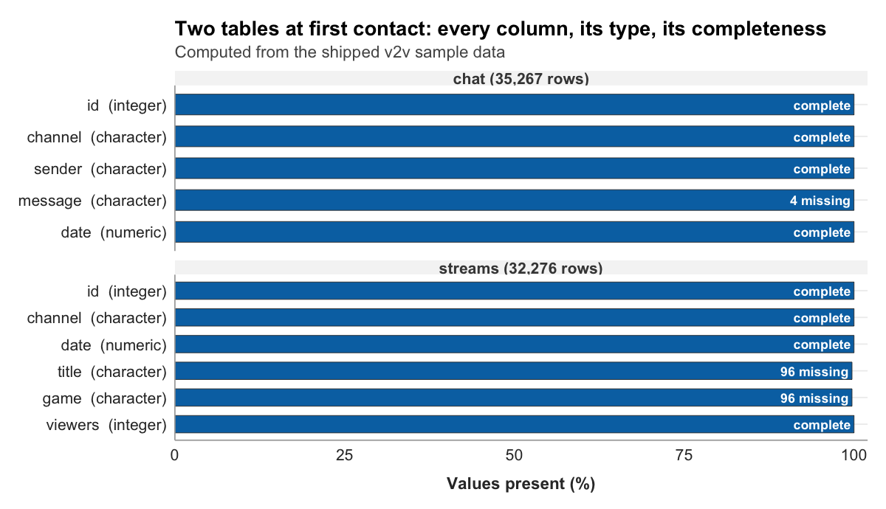

---
title: "Chapter 9: The rulebook and first workspace"
---

{fig-alt="A stylized rendering of an organized desk with a single open notebook."}

Here is a strange thing about the work of the last eight chapters. You have a research question, a theoretical frame, a prospectus, a field-notes document, and a draft codebook. You have, in other words, designed an entire study around the Twitch dataset. And you have never actually seen it.

You have been told what it contains. Chapter 1 described a collection of nearly 1,700 channels recorded across five and a half days of November 2018, Bob Ross streaming under Art while most of the platform played games. Chapter 2 showed ten rows of it. You have taken the rest on trust. This chapter is where the trust ends and the looking begins. By the end of it you will have typed a few lines of R, and the dataset will have stopped being a description and become an object sitting in front of you, one you can inspect column by column.

This is also the chapter where the book changes character. For eight chapters there has been no code, on purpose. Planning a study before writing a line of it is the discipline that makes the code worth writing. But the planning is done. From here forward the work is done in R, and Chapter 9 is the gentle start: it opens a workspace, it loads the data, and it looks. It runs no analysis and computes no result. First contact is its own task, and it is worth doing slowly.

## The workspace

Before the data, the workspace. Chapter 2 argued that reproducible research lives or dies on traceability: a study someone else can rerun is a study built from files in known places, not from commands typed once and forgotten. A **project** is how that happens. It is a single folder that holds everything one study needs, the data, the code, the codebook, the written report, so that the whole study travels together and nothing depends on a file that lives only on your laptop.

The `v2v` package scaffolds one for you. A single call does it:

```r
v2v::new_portfolio("twitch-portfolio")
```

Note the `v2v::` in front of the function name. It is not decoration. It tells R, and tells you, that `new_portfolio()` comes from the `v2v` package specifically, the set of tools this book ships. Every `v2v::` call in the chapters ahead carries that prefix for the same reason: so that the package never becomes a hidden assumption, and you always know which tools are the book's and which are R's own.

Running `new_portfolio()` creates a folder with a structure like this:

```
twitch-portfolio/
├── twitch-portfolio.Rproj
├── _quarto.yml
├── README.md
├── codebook.qmd
├── analysis.qmd
├── data/
└── .Rprofile
```

You did not have to decide where files go, what to name them, or how to wire them together. That is the point. Where to put things is a real source of friction for someone opening a data project for the first time, and an hour lost to it is an hour not spent on the study. The scaffold removes the decision.

One more call confirms the workspace is sound:

```r
v2v::setup()
```

`setup()` checks that R, the packages this book depends on, and the project's environment are all present and the versions agree. You met it once already, in Chapter 2, as the final step of installing the stack. It returns here as a habit worth keeping: run it when you open a project, and you find out about a missing piece before it interrupts you mid-analysis.

## The rulebook becomes a document

Look again at the scaffold. One of the files is `codebook.qmd`.

In Chapter 8 you drafted a codebook on paper: a unit of analysis, three operationalized variables, a set of decision rules. That draft was an argument about how the study would measure things. Now it becomes a document in the workspace, the project's **rulebook**, the reference every later step answers to. Move the Chapter 8 draft into `codebook.qmd`, give it a version line and a date, and render it the way Chapter 2 had you render a one-page Quarto document. Rendering a codebook is not busywork. A codebook that renders cleanly is a codebook with no broken structure, and a rendered codebook is one a second coder can actually read.

Calling this "finalizing" the codebook is slightly optimistic, and it is worth being honest about that. Chapter 10 will pilot the codebook, two coders applying it to the same messages, and piloting routinely sends you back to edit a category or sharpen a rule. What Chapter 9 finalizes is not the content of the rulebook but its status: it stops being a sketch in your notes and becomes the official instrument of the project, versioned, rendered, and ready to be tested. A draft you can revise is exactly what you want walking into a pilot.

## First contact with the data

Now the data. Two lines bring it in.

```r
library(tidyverse)

chat <- v2v::twitch_chat()
streams <- v2v::twitch_streams()
```

The first line loads the tidyverse, the collection of R packages this book uses for everything from inspecting data to drawing figures (Wickham et al., 2019). The next two lines load the dataset itself. `v2v::twitch_chat()` returns the chat data; `v2v::twitch_streams()` returns the stream data. The arrow, `<-`, is R's way of giving the result a name, so `chat` and `streams` now refer to the two tables for the rest of the session.

Notice that the data arrives through a function call, not as a file you opened or a spreadsheet you imported. This is deliberate. A new R user's first encounter with data is often a pile of path errors, the file is somewhere the code cannot find, the format is not what was expected. `twitch_chat()` and `twitch_streams()` are written to remove that entire category of problem: they reach into the `v2v` package, find the data that ships inside it, and hand it back, with no path for you to get wrong. Called with no arguments, as above, each returns the full working sample. They also accept arguments for later, when you want only certain channels or games, but first contact is the no-argument version. Load everything, and look.

It is worth being clear about what "everything" means here. This is not the entire 2018 collection. The full dump runs to tens of millions of rows and well over a gigabyte, too much to ship inside a package or to open comfortably on a laptop. What `v2v` ships, and what you just loaded, is a working sample drawn from the fifty-channel corpus Chapter 1 described: a subset large enough to be real and small enough to be fast. Every example in the chapters ahead runs against this sample.

A word about what happens when this does not work. Sooner or later a line of R you type will return an error instead of a result: a misspelled function name, a package not loaded, a stray bracket. This is normal. It happens to everyone who writes code, and it is not a sign that you are unsuited to the work. The V2V Hub keeps a common-errors cheat sheet for exactly these moments, listing the errors a new R user meets most often and what each one is telling you. From this chapter forward, when a line breaks, that cheat sheet is the first place to look. An error is information, not a verdict.

## Looking at the data

The data is loaded. The first question is simply what it looks like, and the tidyverse function for that is `glimpse()`, which prints every column of a table, its type, and its first few values.

```r
glimpse(chat)
```

```
Rows: 35,267
Columns: 5
$ id      <int> 89, 551, 1033, 2094, 2803, …
$ channel <chr> "sodapoppin", "xqcow", "forsen", "sodapoppin", "xqcow", …
$ sender  <chr> "madzee", "prometheanow", "spectre155", "itsjer", "laserfru…
$ message <chr> "???????????????????????", "TriEasy Clap TriEasy Clap TriE…
$ date    <dbl> 1542578127023, 1542578135562, 1542578143610, 1542578157677…
```

Five columns, 35,267 rows, and each row is one chat message. `id` is a number that uniquely labels the message. `channel` is the channel the message was sent in. `sender` is the account that sent it. `message` is the text itself. `date` is when it was sent.

Two things in that output reward a closer look. The first is `message`. The values are real, and they are not tidy. The first message is twenty-three question marks. The second is the word "TriEasy Clap" repeated over and over, a viewer pasting the same phrase many times. These are not errors in the data. They are what Twitch chat actually contains, and your codebook will have to meet them as they are. The second is `date`. It is a column of enormous numbers, marked `<dbl>`, R's label for a numeric value. Chapter 8 classified this column as interval-level and flagged the catch: the number is a count of milliseconds since 1970, not a date anyone can read. Converting it into a real timestamp is a headline lesson of Chapter 11. For now it is enough to notice that the column is there and that, as it stands, it is unreadable.

The stream table is the same kind of object with different columns.

```r
glimpse(streams)
```

```
Rows: 32,276
Columns: 6
$ id      <int> 4, 10, 18, 61, 105, …
$ channel <chr> "sodapoppin", "xqcow", "forsen", "giantwaffle", "sodapoppin…
$ title   <chr> "Hello truckers\n44835158804929_2115841973", "…", …
$ game    <chr> "Marble It Up!", "Just Chatting", "Artifact", "Rocket Leag…
$ viewers <int> 27934, 19381, 15300, 4697, 28076, …
$ date    <dbl> 1542578200214, 1542578200240, 1542578200273, 1542578200423…
```

Six columns, 32,276 rows, and each row is one snapshot of one stream at one moment: its `title`, the `game` it was filed under, its `viewers` count, and the `date` of the snapshot. The first row should look familiar. It is Sodapoppin's channel, playing Marble It Up!, with 27,934 viewers, the exact row Chapter 2 used to open its discussion of reproducible data. The fifth row is the same channel a few minutes later at 28,076 viewers, the climb Chapter 2 asked you to interpret. You are now looking at the source of that example directly.

The `title` column shows the same messiness as chat. The first title has a line break inside it and a long string of digits, which is not what a tidy title looks like but is what some streamers actually type. Real data is like this, and noticing it now, before any analysis, is the entire reason for first contact.

Beyond seeing the columns, you can count things. The tidyverse verb `count()` tallies how often each value of a column appears. Asking it about `game` shows what the streams are filed under:

```r
streams |> count(game, sort = TRUE)
```

```
# A tibble: 60 × 2
   game                                   n
   <chr>                              <int>
 1 Art                                 5298
 2 Fortnite                            3682
 3 Just Chatting                       2474
 4 Hearthstone                         2157
 5 Pokemon: Let's Go, Pikachu!/Eevee!  1967
 6 League of Legends                   1952
 7 Heroes of the Storm                 1473
 8 Counter-Strike: Global Offensive    1346
 9 Rocket League                       1321
10 World of Warcraft                    920
# ℹ 50 more rows
```

The `|>` is R's **pipe**: it takes the thing on its left and feeds it to the function on its right, so the line reads as an instruction in order, take `streams`, then count its games. The result is itself a small table, sixty rows, one per game, sorted with the most frequent at the top. Sixty categories is more variety than a study can examine one by one, and the count makes the shape of that variety visible: a handful of games account for most of the snapshots, and a long tail of fifty more accounts for the rest. That shape will matter in Chapter 12, when you have to decide how to draw a chart that does not drown in sixty lines.

`count()` is also a quick way to confirm the data is the corpus you expect. Chapter 1 described a working corpus of fifty channels. A related function, `n_distinct()`, counts how many different values a column holds, and asking it about `channel` checks that claim directly:

```r
n_distinct(chat$channel)
```

```
[1] 50
```

Fifty distinct channels in the chat table, and `n_distinct(streams$channel)` returns the same fifty. The data you loaded is the corpus the book has been describing since Chapter 1, no more and no less.

There is one further way to look, worth knowing even though this chapter does not lean on it. Typing a table's name on its own, just `chat`, prints its first rows in a compact form. Running `View(chat)` opens the table in a spreadsheet-style viewer you can scroll. Of the options, `glimpse()` is usually the most useful for seeing a table's shape at a glance, but printing, `View()`, `glimpse()`, and `count()` are all doing the same basic thing: looking, without changing anything.

{fig-alt="Two horizontal bar panels profile the chat table of 35,267 rows and the streams table of 32,276 rows, one bar per column showing the percentage of values present, with each column's type in parentheses. Nearly every column is complete. The exceptions are labeled directly: four chat messages are missing their text, and ninety-six stream snapshots are missing both title and game. Computed from the shipped sample data."}

None of this changed the data. Looking is the whole of what this chapter has done with it. The chat table and the stream table are exactly as they were loaded. Inspection comes before transformation, and Chapter 9 stays entirely on the inspection side of that line.

## Reading the data against the codebook

First contact has one job left, and it is the most important one. Open the codebook next to the `glimpse()` output and ask a blunt question: does this data actually support the study the codebook describes?

Walk the three variables. **Message target** is to be coded from each message, using the message text and, for at-mentions and replies, the sender information. The chat table has a `message` column and a `sender` column. Supported. **Message length** is the character count of the message string. There is a `message` column. Supported. **Contains emote** is read from the message text. There is a `message` column. Supported. The study the codebook designed is a study this data can carry. That is not a small thing to confirm, and it is far better to confirm it now than to discover a missing column halfway through coding.

First contact also surfaces what the codebook will have to work harder at. The messages in the `glimpse()` output are exactly the edge cases Chapter 7's observation log anticipated and Chapter 8's decision rules were written for. The message of twenty-three question marks is a message with no obvious target, the kind Rule 1 and the "unclassifiable" category exist to catch. The repeated "TriEasy Clap" is copypasta, which Rule 3 already addresses. Short tokens like the ones you can expect throughout the chat are emote-only messages, the subject of Rule 2. The codebook did not anticipate these in the abstract. It anticipated them because Chapter 7 had you watch for them, and here they are, in the first five rows.

One genuine wrinkle is worth carrying forward. Among the first messages is one addressed to a streamer: it begins "@xQcOW". The `channel` column for that same row reads "xqcow". The at-mention and the channel name are the same name in different casing, the display name as a viewer typed it against the lowercase login name the data stores. The message-target rule that keys on "an at-mention of the streamer's channel name" will have to account for that difference. This is precisely the kind of refinement that belongs in the codebook now, while it is still the project's living rulebook and before a single message has been coded. First contact has done its work: the study is buildable, and the codebook knows a little more than it did.

::: {.graduate-extension}
::: {.callout-note title="Graduate Extension"}
**Data provenance as a methodological disclosure.** The undergrad edition introduces first contact with data as a moment of exploration: load, inspect, describe. The graduate edition adds a prior step — documenting the *provenance* of the data before the first line of analysis code runs.

When you publish a study, you are making a claim about specific data collected under specific conditions at a specific time. "I collected Twitch chat data" is not a methods section. "I collected 14 days of Twitch chat from the top 10 most-viewed streams in the *Just Chatting* category, using Twitch API v2, between 2024-01-15 and 2024-01-28, saving raw JSON responses to `data/raw/` before any processing" is. The difference matters because replication requires exact knowledge of what was done.

**What the provenance record includes.** For studies using the provided v2v package dataset, provenance is embedded in the package and stable. For studies using fresh API data, the record must include: (1) data source and API version; (2) date and time range of collection; (3) any filters, keywords, or channel selectors applied; (4) format in which raw data was saved; and (5) the git commit at which raw data was frozen (tagged as immutable). Item 5 connects directly to the audit trail: never re-run data collection to overwrite a file that a downstream script already depends on.

**Required reading.** Munafo, M. R., Nosek, B. A., Bishop, D. V. M., Button, K. S., Chambers, C. D., Percie du Sert, N., Simonsohn, U., Wagenmakers, E.-J., Ware, J. J., & Ioannidis, J. P. A. (2017). A manifesto for reproducible science. *Nature Human Behaviour*, *1*, 0021. https://doi.org/10.1038/s41562-016-0021

**Reflect.** (1) Write a four-sentence data provenance statement for the v2v package dataset that would satisfy a journal methods section. What information would you need that is not available in the package documentation? (2) If a journal reviewer asked you to "share the raw data," what would you share and what would you withhold for a study using the v2v package dataset?
:::
:::

## Looking ahead

You have a workspace, a rulebook installed in it, and the data loaded and inspected. Chapter 10 puts the rulebook to the test. It draws a sample of chat messages, the specific messages your study will actually code, and asks the question every content analysis has to answer before its results mean anything: when two coders apply the codebook independently, do they agree? Sampling and inter-coder reliability are the subject, and the codebook you finalized here is what goes on trial.

## References

Wickham, H., Averick, M., Bryan, J., Chang, W., McGowan, L. D., François, R., Grolemund, G., Hayes, A., Henry, L., Hester, J., Kuhn, M., Pedersen, T. L., Miller, E., Bache, S. M., Müller, K., Ooms, J., Robinson, D., Seidel, D. P., Spinu, V., … Yutani, H. (2019). Welcome to the tidyverse. _Journal of Open Source Software_, _4_(43), 1686. https://doi.org/10.21105/joss.01686
