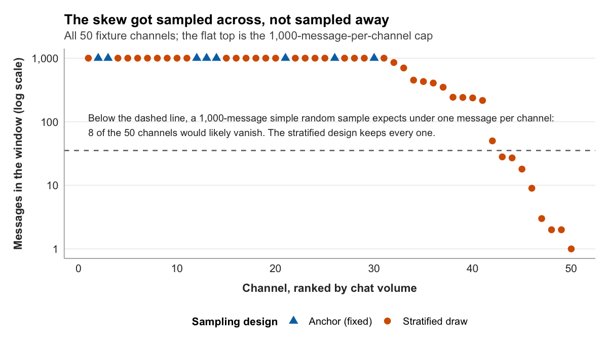

::: {.chapter-audio}
[Listen in Dr. Leith's voice]{.audio-label}

```{=html}
<audio class="v2v-audio v2v-audio-ug" controls preload="none"><source src="../audio/ch10-ug.mp3" type="audio/mpeg">Your browser does not support audio.</audio>
<audio class="v2v-audio v2v-audio-grad" controls preload="none"><source src="../audio/ch10-grad.mp3" type="audio/mpeg">Your browser does not support audio.</audio>
```

:::


Suppose you sat down to code the chat fixture by hand, one message at a time, the codebook open beside you. Read the message, decide who it is aimed at, record the code, move to the next. At a brisk and probably unsustainable pace of one message every ten seconds, the 35,267 messages in the fixture would take just under a hundred hours. The full 2018 collection, all twenty-two million messages, would outlast your degree.

So you will not code all of it. You will code a **sample**: a smaller set of messages, drawn carefully enough that what you learn from coding it holds for the larger collection it came from. Drawing that sample well is the first half of this chapter.

The second half is a test. The codebook you finalized in Chapter 9 is an argument about how messages should be classified, but an argument on paper is not yet a working instrument. A codebook earns that status only when a second person can pick it up, apply it to the same messages you would, and reach the same codes. Whether your codebook clears that bar is not something you can know by reading it. You have to test it. This chapter draws the sample and runs the test, and the test is the part that can send you back to Chapter 8.

## Why you sample

Chapter 1 drew a distinction between a population and a sample, and it is worth recovering here because the rest of the chapter rests on it. The **population** is the full set of cases you want your conclusions to be about. For the chat study, that is something like all chat messages sent in the fifty-channel corpus during the collection week. The sample is the subset you actually examine.

Sometimes you do not need a sample. Coding every case is called a **census**, and it is the right move when the population is small enough to handle whole. The stream fixture is close to this: at roughly 32,000 snapshots it ships in its entirety, no sampling involved, because the snapshot count for fifty channels is small enough to keep all of it.

Chat is the opposite situation. There is far too much of it to code by hand, and so a census is off the table. This is the ordinary condition of content analysis. The point of a sample is to make the work finite without making the conclusions worthless, and that depends entirely on how the sample is drawn. A sample of 1,500 messages can support a sound study or a misleading one. The difference is method.

## Why a simple random sample is not enough

The most familiar way to draw a sample is **simple random sampling**: give every message in the population an equal chance of selection and draw the number you need. It has one large virtue. It is unbiased, in the precise sense that no message is favored over any other, so the sample carries no systematic tilt built in by the researcher.

For Twitch chat, that virtue is not enough, and the reason is the shape of the data. Chat volume is not spread evenly across channels. It is severely concentrated. In the full population the busiest channel logged more than a million messages during the collection week; the median channel logged around 1,440; the quietest logged one. A distribution like that is called **right-skewed**, a small number of enormous values and a long tail of small ones, and it has a hard consequence for sampling. Draw messages at random from that population and the overwhelming majority will come from the handful of giant channels, because that is where the overwhelming majority of messages are. The small and middling channels, which is to say most of Twitch, would barely appear in the sample at all.

The same problem shows up along a second dimension. Forty-three of the fifty channels in the corpus are gaming channels. Only a handful are not: Bob Ross's painting channel is the clearest case. A simple random sample of messages would be drawn almost entirely from gaming chat, simply because that is where almost all the messages are. For a study whose central comparison is gaming against non-gaming chat, that is close to fatal. The sample would have plenty of one side of the comparison and almost nothing of the other.

This is the trap of simple random sampling on skewed data. It is unbiased and still unrepresentative of the things you care about. It faithfully reproduces the population's imbalance at sample size, when what the study needs is enough of every group to compare them.

## Stratified sampling

The fix is **stratified sampling**. Instead of drawing from the population as one undifferentiated pool, you first divide it into meaningful subgroups, called **strata**, and then draw a sample from within each stratum separately. Every stratum is guaranteed a place in the final sample, in whatever proportion you decide, rather than in whatever proportion the population happens to hand you.

The strata have to be chosen to matter for the research question. For the chat study the natural stratifying variable is the channel. Dividing the population by channel and drawing a fixed number of messages from each guarantees that the small channels appear in the sample at the same strength as the giant ones, which is exactly what a simple random draw would not do. Because gaming and non-gaming status is a property of the channel, stratifying by channel also rescues the study's central comparison: every non-gaming channel is in the sample by construction, not by luck.

It is worth knowing that the fixture you loaded in Chapter 9 is itself the product of a stratified design. Its fifty channels were not the fifty busiest. Eight were chosen as fixed anchors for pedagogical variety, Bob Ross among them as the deliberate non-gaming case. The other forty-two were drawn by sorting the rest of the population into ten bands by chat volume and sampling from every band, so that the corpus spans the full range from the busiest channels to the quietest rather than just the head of the distribution. The skew did not get sampled away. It got sampled across, on purpose.

{fig-alt="Fifty channels ranked by chat volume on a logarithmic axis, spanning one thousand messages down to a single message. Triangles mark the eight fixed anchor channels and circles the forty-two stratified draws. A dashed line marks the volume below which a 1,000-message simple random sample would expect less than one message per channel; eight channels fall below it, so the quietest channels survive only because the stratified design guarantees them a place."}

One feature of stratified sampling matters when the strata are uneven in size. If you ask for thirty messages per channel but a channel only ever produced nine, there is no way to draw thirty. The sensible rule, and the one the tools here follow, is to take everything that channel has. In the fixture, nineteen of the fifty channels hold fewer than a thousand messages, and a few hold only a handful. For those small strata, a request for a fixed number simply returns all of it. That is the right floor: a stratum contributes its full weight or, if it is too small, its full self.

::: {.graduate-extension}
**Purposive sampling does not fix inadequate power.** A common misconception is that purposive sampling (selecting "most relevant" units) compensates for a small *n*. It does not. Purposive sampling improves construct validity; it has no effect on statistical power. The two concerns address different inferential problems, and conflating them produces a study that is internally coherent but statistically indefensible.
:::

## Drawing the sample

With the logic settled, the draw itself is one function call. `v2v::sample_messages()` takes the data, the variable to stratify by, and the number to draw from each stratum.

```r
set.seed(409)

coding_sample <- v2v::sample_messages(chat, by = channel, n = 30)
```

The `by = channel` argument makes each channel a stratum. The `n = 30` argument asks for thirty messages from each. With fifty channels that aims at roughly 1,500 messages, a sample large enough to support the study and small enough to code by hand, with the small channels contributing all they have where thirty is more than they hold.

The first line, `set.seed()`, is not optional, and it is worth being clear about why. Drawing a sample is a random process: run it twice and you get two different samples. `set.seed()` fixes the starting point of R's random number generator, so that the "random" draw comes out identically every time the code is run. Without it, your sample is unreproducible, and an unreproducible sample undermines everything Chapter 2 argued for. Anyone who reruns your analysis, including you in six months, would be working with different messages and could not check your results against the originals. The specific number is arbitrary; 409 has no meaning. What matters is that a number is set and recorded, so the draw is frozen.

`coding_sample` now holds the messages the study will code. The sampling half of the chapter is done. The harder question is whether the codebook is ready to code them.

::: {.graduate-extension}
**The conversation between your prospectus and your sample.** Sampling is not only a practical tradeoff about capturing the variation in your dataset. Your sample must also be large enough to detect the effect you expect with adequate power. Your prospectus power analysis (Chapter 6) specified a minimum *n* at your chosen effect size and power level, and Chapter 10 is where that number meets the realities of your dataset. If your power analysis requires 128 coded units and your platform generates 10,000 units in your collection window, stratified sampling solves the problem. If your platform generates only 80 units, you face a constraint: the study is underpowered, and you must either change the design (longer collection window, multiple platforms, or a revised research question targeting a larger expected effect) or explicitly justify the limitation in the prospectus. For your own study, identify the minimum *n* from your Chapter 6 power analysis and the maximum *n* available from your dataset; if they conflict, document the conflict and propose one design modification that resolves it, and weigh the ethical implication of publishing a study you know is underpowered because adequate data were unavailable, along with how the limitations section should handle it. Lakens (2022) is blunt about what honesty demands once the available data fall short of the design:

> "Do not try to spin a story where it looks like a study was highly informative when it was not. Instead, transparently evaluate how informative the study was given effect sizes that were of interest, and make sure that the conclusions follow from the data."
>
> Lakens (2022, p. 11)
:::

## The pilot test

You finalized the codebook in Chapter 9, and Chapter 9 was careful about the word. It finalized the codebook's status, not its content. The reason for that hedge is the **pilot test**, and this is where it comes due.

A pilot test is a trial run of the codebook before the real coding begins. A subset of the sample, a hundred messages is a reasonable size, is coded not by one person but by two, working from the same codebook. Then their codes are compared. The question the comparison answers is the one that decides whether the codebook is an instrument or just a document: when two people apply these rules independently, do they produce the same classifications?

That word, independently, carries the whole logic. The two coders must work in genuine isolation, no conferring, no comparing notes, no checking each other as they go. The reason is not suspicion. It is that the pilot is measuring the codebook, not the coders. If the two of them discuss a hard message and agree on how to code it, their later agreement on similar messages measures their memory of that conversation, not the clarity of the codebook. Only independent coding tests what the study actually needs to know, which is whether the written rules are clear enough to carry a classification on their own, without their author standing beside the coder to interpret them.

Chapter 8 introduced the idea of **reliability** and promised that the way to measure it would come later. This is later. Reliability is consistency, the property that the codebook produces the same answer regardless of who is holding it, and the pilot test is how reliability stops being a hope and becomes a number.

## Why raw agreement is not enough

The obvious way to turn the pilot into a number is to count how often the two coders matched. If they agreed on the code for 74 of the 100 pilot messages, that is 74 percent agreement, and 74 percent sounds respectable.

It is also misleading, and seeing why is the key idea of the chapter. Some agreement between two coders happens for no good reason at all. It happens by luck.

Cohen's 1960 paper that introduced the standard fix made the point with a sharp example. Imagine two clinicians independently sorting patients into two categories, and suppose each one, rather than examining anyone, simply assigns the categories blindly at the rates the categories happen to occur. The two of them, coordinating on nothing, would still agree a large share of the time, purely because there are only so many categories to land on. Agreement produced that way is worth nothing. It reflects the number of categories and how often each is used, not the soundness of any judgment.

Raw agreement cannot tell that empty agreement apart from the real kind. It counts every match the same, the ones that reflect a clear shared rule and the ones that are coincidence. When the categories are few, or one category is far more common than the others, the coincidental matches pile up fast, and raw agreement drifts upward on their strength. A figure of 74 percent might reflect a genuinely clear codebook. It might also be mostly luck. The number alone does not say.

What you need is a measure that starts from the agreement actually observed, estimates how much agreement chance alone would have produced, and credits the codebook only with the difference. That is what a reliability statistic does.

## Cohen's kappa and Krippendorff's alpha

Two such statistics cover most of content analysis, and the `v2v::reliability()` function computes either one, selected by its `method` argument.

**Cohen's kappa** is the first, introduced in the 1960 paper just mentioned (Cohen, 1960). It is built for the common case: two coders, applying a nominal codebook. Its logic is exactly the correction described above. Conceptually, kappa is the observed agreement minus the agreement expected by chance, divided by the room for improvement that chance left on the table:

```
kappa = (observed agreement - expected agreement) / (1 - expected agreement)
```

When the coders do no better than chance, the numerator is zero and kappa is zero, whatever the raw agreement looked like. When they agree perfectly, kappa is one. A codebook is credited only for the agreement it produced beyond luck.

**Krippendorff's alpha** is the second, and it is the more general instrument (Krippendorff, 2018). Where Cohen's kappa assumes exactly two coders and nominal categories, alpha accommodates any number of coders, any level of measurement from nominal to ratio, and datasets with missing codes. For a study with three coders, or one whose central variable is ordinal, alpha is the appropriate choice; for the standard two-coder nominal pilot, kappa and alpha will tell much the same story, and kappa is the more familiar choice for that case. `v2v::reliability(coder_a, coder_b, method = "alpha")` computes alpha; `method = "kappa"` computes kappa.

Either way the result is a number between roughly zero and one, and a number needs a standard to be read against. The most cited one comes from Landis and Koch (1977), who attached descriptive labels to ranges of agreement: values around 0.0 to 0.2 they called slight, 0.2 to 0.4 fair, 0.4 to 0.6 moderate, 0.6 to 0.8 substantial, and above 0.8 almost perfect. Those labels are a vocabulary, not a law, and published content analysis tends to apply a stricter working rule: a reliability coefficient below about 0.70 is generally treated as too low to proceed on, with 0.80 a more comfortable floor. The exact threshold is a judgment call that depends on the stakes of the study. The principle is not: a codebook that cannot clear a defensible threshold is not ready to be used.

## A worked reliability check

To see what a failed check looks like, and why codebooks fail it, consider a deliberately stark example.

Imagine the codebook included a loosely worded variable. It asked coders to flag the pilot's "high-energy" messages, the pure expressive reactions, but it never pinned down what that meant in operational terms. Two conscientious coders, each trying to apply the instruction, each settle on a concrete rule of their own. Coder A decides a high-energy message is one carrying a Twitch emote, a token like LULW or KEKW, and flags messages on that basis. Coder B decides a high-energy message is one that shouts, and flags every message containing a word in all capitals. Both rules are reasonable readings of "high-energy." Both coders believe they are coding the same variable.

They code the first hundred messages of the sample independently, and their codes go into `v2v::reliability()`:

```r
v2v::reliability(pilot$coder_a, pilot$coder_b, method = "kappa")
```

```
Inter-coder reliability: Cohen's kappa

  Messages coded   100
  Cohen's kappa    0.236
```

The two coders agreed on 74 of the 100 messages, the same 74 percent that looked respectable a few pages ago. But chance alone, given how often each coder flagged a message, would have produced agreement on about two-thirds of them. Run that through the formula, observed agreement of 0.74 against expected agreement of about 0.66, and the result is roughly 0.24. The function reports it as 0.236.

By the Landis and Koch labels, 0.236 is fair agreement. By any working threshold for publishable content analysis, it is a failure, far below 0.70. And the diagnosis is exact. The raw agreement of 74 percent was almost all coincidence. Emote-bearing messages and all-caps messages overlap a fair amount in Twitch chat, enough that two coders keying on those different features would land on the same answer often, without ever coding the same concept. The loose codebook let two careful people measure two different things while believing they measured one. That is what kappa exposed and raw agreement concealed.

## When reliability fails: revising the codebook

A kappa of 0.236 is not a result to report. It is an instruction, and the instruction is to stop and fix the codebook before any real coding happens.

The fix begins with diagnosis. The two coders, who until now have worked in isolation, finally meet and go through the messages they classified differently, one by one. The disagreements are the data. They show precisely where the codebook ran out of guidance: a category whose boundary is fuzzy, a kind of message the rules never anticipated, a term that two readers can take two ways. In the worked example the diagnosis is plain, because the variable was never operationally defined at all. The repair is to define it: state in the codebook exactly what counts as a high-energy message, with the kind of explicit decision rules Chapter 8 built for the message-target variable, so that two coders are no longer free to invent their own.

Then the codebook, now revised, is piloted again. New coders or the same coders, a fresh subset of messages, another independent coding, another reliability coefficient. The cycle, pilot, diagnose, revise, repeat, continues until the coefficient clears the threshold. Only then does full coding of the sample begin.

This is why Chapter 9 finalized only the codebook's status and not its content. A codebook is a living instrument right up until a pilot test certifies it, and a pilot test has the standing to send it back for revision however many times that takes. The discipline is to treat a low reliability coefficient as useful news rather than an obstacle. It has told you, before you invested weeks in coding, that the instrument was not yet sound. That is the pilot test working exactly as intended.

## Looking ahead

You now have a sample drawn and, once it has cleared its pilot, a codebook trusted to classify it. What you do not yet have is data in a form ready for analysis. The chat and stream tables are still separate, the timestamps are still unreadable integers, and the variables the study needs, message length and the gaming context of each message, do not yet exist as columns. Chapter 11 takes that on. It is the wrangling chapter: the one where the raw tables are reshaped, joined, and cleaned into the single tidy dataset every later analysis depends on.

## References

Cohen, J. (1960). A coefficient of agreement for nominal scales. _Educational and Psychological Measurement_, _20_(1), 37-46. https://doi.org/10.1177/001316446002000104

Krippendorff, K. (2018). _Content analysis: An introduction to its methodology_ (4th ed.). SAGE Publications.

Landis, J. R., & Koch, G. G. (1977). The measurement of observer agreement for categorical data. _Biometrics_, _33_(1), 159-174. https://doi.org/10.2307/2529310

::: {.graduate-extension}
### Graduate readings

Lakens, D. (2022). Sample size justification. *Collabra: Psychology*, *8*(1), 33267. https://doi.org/10.1525/collabra.33267
:::
