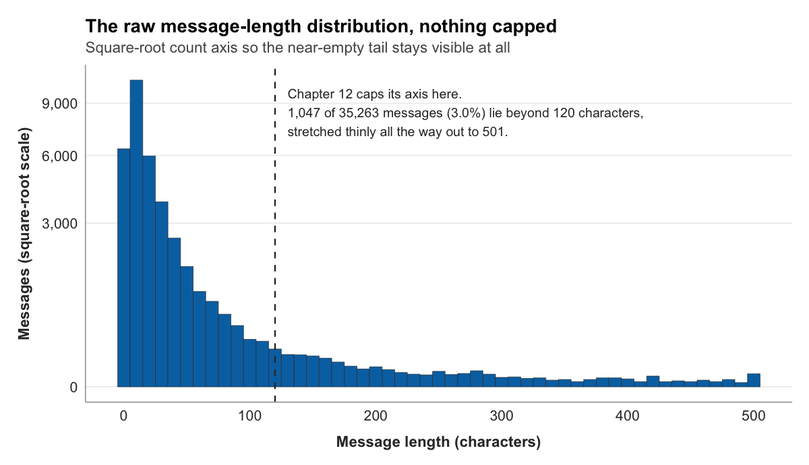

::: {.chapter-audio}
[Listen in Dr. Leith's voice]{.audio-label}

```{=html}
<audio class="v2v-audio v2v-audio-ug" controls preload="none"><source src="../audio/ch11-ug.mp3" type="audio/mpeg">Your browser does not support audio.</audio>
<audio class="v2v-audio v2v-audio-grad" controls preload="none"><source src="../audio/ch11-grad.mp3" type="audio/mpeg">Your browser does not support audio.</audio>
```

:::


The chat table you loaded in Chapter 9 cannot answer your research question. Not yet. The study asks whether chat behaves differently on gaming and non-gaming channels, and it operationalizes that through message length. But look at the table. There is no column for message length. There is no column saying whether a message came from a gaming channel or a non-gaming one. The timestamps are unreadable runs of digits. And the information that would settle the gaming question is not even in the chat table; it sits in a separate stream table that the chat table has no link to.

This is the ordinary situation at this stage of a study, and closing the gap is the work of this chapter. **Data wrangling** is the process of turning the data you collected into the data you can analyze: reshaping it, cleaning it, deriving the variables your codebook named, and joining separate tables into one. It is unglamorous, it is rarely mentioned in the published paper, and it is most of the work. A wrangling chapter looks like a sequence of small technical steps. What it is actually doing is building the table that every later result depends on.

## The verbs of data wrangling

The tidyverse handles wrangling through a small set of functions, each of which does one clear thing to a data frame. They are usually called the **dplyr** verbs, after the package they live in, and five of them carry most of the work.

**`filter()`** keeps rows that meet a condition and drops the rest. To look at only Bob Ross's messages:

```r
chat |> filter(channel == "bobross")
```

**`select()`** keeps or drops columns:

```r
chat |> select(channel, sender, message)
```

**`mutate()`** adds a new column, or changes an existing one, computed from the columns already there. **`arrange()`** reorders the rows by a column's values. And **`group_by()`** together with **`summarize()`** collapses many rows into one per group, which is how you compute a per-channel or per-game figure.

The reason these verbs combine so well is a shared design: each one takes a data frame and returns a data frame. That is what lets the pipe string them into a sequence, the output of one verb flowing in as the input of the next. A wrangling pipeline is just verbs chained this way, each step a small readable transformation, the whole chain carrying the data from raw to ready. The rest of this chapter is four such transformations.

::: {.graduate-extension}
**The wrangling script as a methods section.** A wrangling script is a *documented transformation chain*: a sequence of decisions, each recorded in version-controlled code, that connects raw data to analysis-ready data. Every `mutate()`, `filter()`, and `group_by()` is a methodological decision. You decided which cases to exclude and why. You decided how to handle missing values. You decided how to aggregate timestamp data into time windows. When a reviewer asks "how did you handle cases where the streamer's username appeared in the chat?", the answer is in the wrangling script, but only if the script is version-controlled and decision points are commented. For your own study, identify three wrangling decisions a reviewer might challenge, and for each add a comment stating the decision rule and its justification.
:::

## Making the timestamp readable

Start with the timestamps, because Chapter 9 already flagged them. The `date` column is a column of very large numbers, and Chapter 8 classified it as interval data with a catch: the number is not a date in any form a person can read.

What the number actually holds is a count of milliseconds elapsed since midnight on the first of January, 1970. That reference moment is the **Unix epoch**, the zero point nearly all computers use to keep time, and counting from it is how a timestamp becomes a single integer. The integer is precise and entirely unreadable. Turning it back into a date is a conversion, and `mutate()` is the verb for it:

```r
chat <- chat |>
  mutate(timestamp = as.POSIXct(date / 1000, origin = "1970-01-01", tz = "UTC"))
```

Two parts of that line carry the lesson. `as.POSIXct()` is the function that turns a number into a date-time value, given the origin to count from. And `date / 1000` is the part it is easy to get wrong. `as.POSIXct()` expects a count of seconds, but the `date` column is a count of milliseconds, a thousand times finer. Hand it the raw number and it will place every message tens of thousands of years in the future. Dividing by 1,000 converts milliseconds to seconds first. It is a small arithmetic step and the single most common way this conversion fails.

The result is a real date-time. Setting `date` and the new `timestamp` side by side shows the transformation:

```r
chat |> select(date, timestamp) |> head(3)
```

```
# A tibble: 3 × 2
           date timestamp
          <dbl> <dttm>
1 1542578127023 2018-11-18 21:55:27
2 1542578135562 2018-11-18 21:55:35
3 1542578143610 2018-11-18 21:55:43
```

The same instant, now legible: the evening of the 18th of November, 2018. The column type has changed too, from `<dbl>`, an ordinary number, to `<dttm>`, a date-time. That new type is what makes the column useful. From a real date-time you can pull the hour of day, the day of week, the calendar date, none of which can be read off the raw integer. Chapter 12 will use exactly that to chart how chat volume rises and falls across the hours of the day.

## Measuring message length

The second transformation creates a variable the codebook named but the data does not yet contain. Message length, the character count of a message, is `mutate()` again, this time with `str_length()`, which counts the characters in a string:

```r
chat <- chat |>
  mutate(message_length = str_length(message))
```

```r
chat |> select(message, message_length) |> head(3)
```

```
# A tibble: 3 × 2
  message                                 message_length
  <chr>                                             <int>
1 "???????????????????????"                           23
2 "TriEasy Clap TriEasy Clap TriEasy Cla…"            441
3 "cmonBruh"                                            8
```

`message_length` is a ratio variable, in the Chapter 8 sense: a true zero, equal intervals, a count you can average and compare. The three values above also preview something. A single-word message of eight characters, a row of punctuation at twenty-three, and a block of copy-pasted text at 441 are all real Twitch chat, and the distance between them is large. That spread is the raw material of the study, and Chapter 12 will look hard at its shape.

{fig-alt="A histogram of all 35,263 message lengths with nothing capped, on a square-root count axis. The distribution peaks below 20 characters and falls away steeply; a dashed line at 120 characters marks where Chapter 12 will cap its axis. Only 1,047 messages, three percent, lie beyond that line, stretched thinly all the way out to 501 characters, which is why the cap costs almost nothing."}

## Labeling gaming and non-gaming

The third transformation is the one the central research question turns on. Every message needs a label: did it come from a gaming channel or a non-gaming one? That label does not exist in the chat table, and building it takes more work than the last two, because the information lives in the other table.

Gaming or non-gaming is best understood as a property of the channel, fixed by what the channel mostly streams. Bob Ross's channel streams painting; it is a non-gaming channel, and every message in it is a non-gaming message. So the label is built in three steps: find what each channel mostly streams, decide whether that counts as gaming, and attach the decision to every message from that channel.

The first step reaches into the stream table. Each channel appears there many times, once per snapshot, each snapshot carrying the `game` it was streaming. The channel's dominant category is the **modal** category, the one that appears most often:

```r
channel_type <- streams |>
  filter(!is.na(game)) |>
  count(channel, game) |>
  group_by(channel) |>
  slice_max(n, n = 1, with_ties = FALSE) |>
  ungroup()
```

The pipeline reads in order. Drop snapshots with no recorded category. Count how many snapshots each channel logged in each category. Then, within each channel, keep only the single most frequent category. The result is one row per channel, naming what that channel streamed most.

The second step is a judgment, and it should be visible rather than buried. Twitch sorts streams into categories, and some of those categories are not games: painting under Art, unstructured talk under Just Chatting, and others. Listing them explicitly states the rule the study is using:

```r
nongaming_categories <- c(
  "Art", "ASMR", "Beauty & Body Art", "Creative", "Food & Drink",
  "IRL", "Just Chatting", "Makers & Crafting", "Music",
  "Music & Performing Arts", "Science & Technology",
  "Sports & Fitness", "Talk Shows & Podcasts", "Travel & Outdoors"
)

channel_type <- channel_type |>
  mutate(is_gaming = !(game %in% nongaming_categories)) |>
  select(channel, is_gaming)
```

`game %in% nongaming_categories` asks whether a channel's dominant category is on the non-gaming list; the `!` negates it, so `is_gaming` is `TRUE` for every channel whose main category is a game and `FALSE` otherwise. `channel_type` is now a compact lookup table: one row per channel, one column saying gaming or not.

The third step is the **join**. A join brings columns from one table onto another by matching on a shared key, here the channel name. A `left_join()` keeps every row of the chat table and attaches the matching `is_gaming` value to it:

```r
chat <- chat |>
  left_join(channel_type, by = "channel")
```

A join is only as good as the match between its keys, and that is worth a word of warning. Twitch's chat protocol writes channel names with a leading "#", so the same channel can appear as `#bobross` in one source and `bobross` in another. Join two tables whose keys disagree like that and every row fails to match, silently. The `v2v` fixture has already normalized this, the "#" stripped before the data ever reached you, but raw Twitch data would need that cleaning step first. When a join returns nothing, mismatched keys are the first thing to check.

One result of the join deserves attention. Always inspect a column you just derived:

```r
chat |> count(is_gaming)
```

```
# A tibble: 3 × 2
  is_gaming     n
  <lgl>     <int>
1 FALSE      3457
2 TRUE      31309
3 NA          501
```

Two channels in the corpus streamed without ever having a category recorded: every one of their stream snapshots had a missing `game`. With no categories at all, there is no modal category, so those channels never made it into `channel_type`, and the `left_join()` left their messages with `is_gaming` set to `NA`. That is the correct outcome, not a bug. The data genuinely does not say whether those 501 messages came from gaming channels, and an honest `NA` records that the study cannot classify them. They will sit out the gaming comparison rather than being guessed into one side of it.

## The analysis-ready table

Four transformations, run in sequence, have rebuilt the chat table:

```r
chat <- v2v::twitch_chat() |>
  mutate(
    timestamp = as.POSIXct(date / 1000, origin = "1970-01-01", tz = "UTC"),
    message_length = str_length(message)
  ) |>
  left_join(channel_type, by = "channel")
```

A final `glimpse()` shows what the table has become:

```
Rows: 35,267
Columns: 8
$ id             <int> 89, 551, 1033, 2094, 2803, …
$ channel        <chr> "sodapoppin", "xqcow", "forsen", "sodapoppin", "xqcow…
$ sender         <chr> "madzee", "prometheanow", "spectre155", "itsjer", "la…
$ message        <chr> "???????????????????????", "TriEasy Clap TriEasy Cla…
$ date           <dbl> 1542578127023, 1542578135562, 1542578143610, 1542578…
$ timestamp      <dttm> 2018-11-18 21:55:27, 2018-11-18 21:55:35, 2018-11-18…
$ message_length <int> 23, 441, 8, 12, 206, …
$ is_gaming      <lgl> TRUE, FALSE, TRUE, TRUE, FALSE, …
```

This is what wrangling was for. The table is now **tidy**, in the precise sense the term carries in data science (Wickham, 2014): each row is one observation, a single chat message; each column is one variable; and everything the study needs sits in this one place. The unreadable integers have become timestamps. Message length and gaming status, named in the codebook and absent from the raw data, are now columns. The chat and stream tables, once disconnected, are joined.

None of this was analysis. Not a single result has been computed. But every result that follows, every figure in Chapter 12 and every test in Chapter 13, will be computed from this table, which is why the care spent building it is not optional. A wrangling mistake does not announce itself. It travels quietly into every chart and every statistic downstream. The reward for getting this chapter right is that nothing later has to be unwound.

::: {.graduate-extension}
**Tidy data as the target state.** Wickham's tidy data principles (one observation per row, one variable per column, one value per cell) are not just a preference. They are the structural assumption that every `tidyverse` function makes about its inputs and produces about its outputs. Wickham (2014) defines the target in one sentence:

> "Tidy data is a standard way of mapping the meaning of a dataset to its structure."
>
> Wickham (2014, p. 4)

Wrangling that produces tidy data is wrangling that can be audited: the structure itself is a transparency claim.
:::

::: {.graduate-extension}
**Never overwrite raw data.** `data/raw/` is read-only after the first commit. Your wrangling script reads from `data/raw/` and writes to `data/processed/`. This separation means you can reproduce the processed dataset from scratch by re-running the wrangling script against the immutable raw data. Overwriting raw data severs this guarantee. To test the guarantee on your own study, re-run your wrangling script from a fresh R session against the raw data: if it does not produce the same processed dataset without manual intervention, find the undocumented dependency you missed.
:::

## Looking ahead

The data is tidy and the variables exist. The next move is to look at them. Chapter 12 turns the analysis-ready table into figures: how chat volume moves across the hours of the day, how viewership splits across game categories, and how the distribution of message length compares between gaming and non-gaming channels. It is the chapter where the study's central question finally meets a picture of the answer.

## References

Wickham, H. (2014). Tidy data. _Journal of Statistical Software_, _59_(10), 1-23. https://doi.org/10.18637/jss.v059.i10
