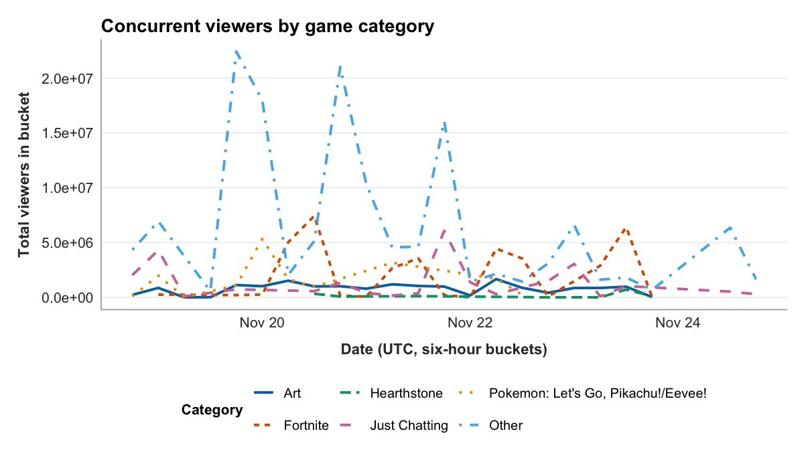
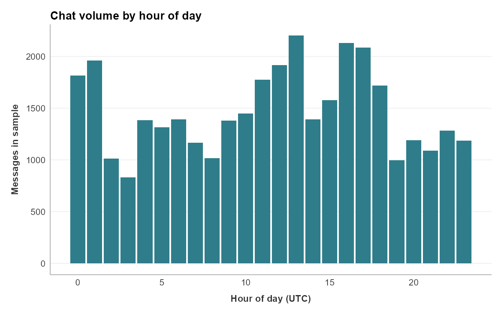
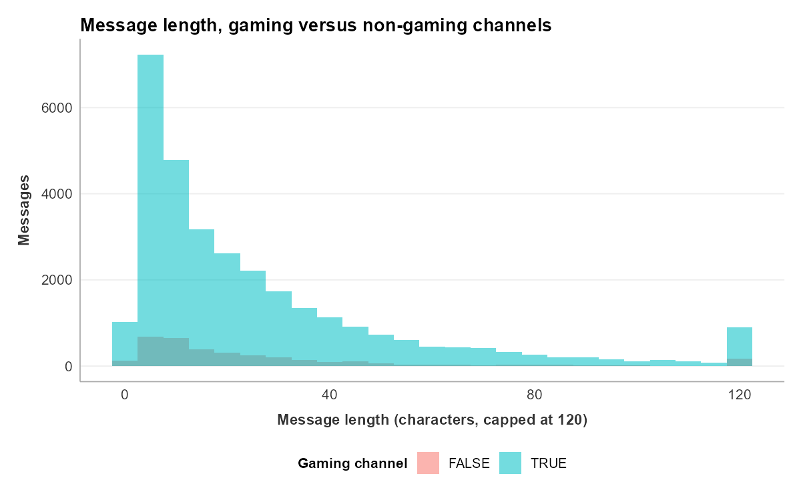

---
title: "Chapter 12: Visualizing the narrative"
---

Chapter 11 ended with a single tidy table, `analysis`, a little over thirty-five thousand rows wide. That table is a complete and faithful record of the chat study's data, and it is almost impossible to read. Nobody can scroll thirty-five thousand rows and come away knowing whether gaming chat runs longer than non-gaming chat, or when in the day the channels are busiest. The numbers are all present. The pattern is not visible.

A figure is the instrument that makes the pattern visible. It takes a column of numbers too long to hold in the mind and turns it into a shape the eye can read at a glance: a line that rises, a bar that towers over its neighbors, a distribution that leans hard to one side. This chapter builds three such figures from the analysis table. Each one answers a question the study has been carrying since its prospectus, and each one is a different kind of chart, chosen to fit a different kind of question.

The chapter's title is a claim about what that work is for. A figure does not merely display data. A well-made figure carries an argument: it shows the reader what the analyst found and why it matters. Visualization is not decoration applied after the analysis. It is part of the analysis, and it is where the study's narrative first becomes something other people can see.

## The grammar of graphics

The figures in this chapter are built with **ggplot2**, the R package that has become the standard tool for statistical graphics (Wickham, 2016). What makes ggplot2 worth learning is not a catalog of chart types. It is a single idea, borrowed from a book by Leland Wilkinson called _The Grammar of Graphics_ (Wilkinson, 2005): that every statistical graphic can be described as the same small set of parts, combined in different ways.

Three parts do most of the work. The first is the **data**, the table being shown. The second is a set of **aesthetic mappings**, which say how columns of that table correspond to visual properties of the plot: this column to the horizontal position, that column to the vertical position, a third to color. The third is a **geometry**, the kind of mark used to draw the data, a line or a bar or a point. Choose the data, map the columns to aesthetics, pick a geometry, and a plot is specified.

In code the three parts sit in a recognizable skeleton:

```r
ggplot(data, aes(x = ..., y = ...)) +
  geom_line()
```

`ggplot()` names the data and, inside `aes()`, the aesthetic mappings. `geom_line()` is the geometry. The `+` is ggplot2's way of stacking layers: each piece is added to the plot, and a figure is assembled by composition rather than written all at once. Changing one part changes the figure without disturbing the rest. Swap `geom_line()` for `geom_col()` and the same data is drawn as bars. That is the payoff of a grammar. A handful of interchangeable parts covers an enormous range of figures, and learning the parts is learning all of them at once.

The three figures that follow are three settings of the same grammar.

## A line for change over time

The first question is about viewership. Across the collection week, how did the audience for these fifty channels move, and how was it split across the games being played?

When the horizontal axis is time and the vertical axis is a quantity that rises and falls, the natural geometry is the **line chart**. A line connects one moment to the next, and the eye reads the climb and the drop as a single continuous motion. That is what makes a line right for change over time and wrong for unordered categories: it implies that the points are in sequence and that the space between them is real.

The data needs shaping first, the kind of dplyr work Chapter 11 covered. The stream snapshots are grouped into six-hour buckets, the long tail of games is collapsed so that only the five most common categories keep their names and the rest become "Other," and the viewer counts are summed within each bucket:

```r
library(tidyverse)

viewers_over_time <- streams |>
  filter(!is.na(game)) |>
  mutate(
    timestamp = as.POSIXct(date / 1000, origin = "1970-01-01", tz = "UTC"),
    six_hour  = floor_date(timestamp, "6 hours"),
    category  = fct_lump_n(game, n = 5)
  ) |>
  group_by(six_hour, category) |>
  summarise(total_viewers = sum(viewers), .groups = "drop")
```

With the data in shape, the figure itself is short. The aesthetic mappings send the time bucket to the x-axis, the summed viewers to the y-axis, and the game category to color, so each category gets its own line:

```r
ggplot(viewers_over_time, aes(x = six_hour, y = total_viewers, color = category)) +
  geom_line(linewidth = 0.9) +
  labs(
    title = "Concurrent viewers by game category",
    x = "Date (UTC, six-hour buckets)",
    y = "Total viewers in bucket",
    color = "Category"
  ) +
  v2v::scale_colour_v2v() +
  v2v::theme_v2v()
```

The last line is worth a note. `v2v::theme_v2v()` applies a single consistent visual theme, the fonts, spacing, and gridlines of a publication-ready figure, in one call. Every figure in this chapter ends with it, so the three look like members of one set rather than three unrelated charts.

{fig-alt="A line chart with one line per game category across November 18 to 24, 2018. The Other category towers over the rest, spiking above 20 million viewers several times, while Art, Fortnite, Hearthstone, Just Chatting, and Pokemon stay low near the axis."}

The figure has an obvious headline. The line that dominates the plot is "Other," the catch-all holding every game outside the top five, and it spikes far above any named category. That fact can be read two ways, and a careful analyst holds both. One reading is substantive: the viewership in this corpus is genuinely spread across a long tail of games, with no single title commanding the audience the way a casual observer might expect. The other reading is a caution about the chart's own choices: lumping more than fifty categories into one bucket all but guarantees that bucket will be the largest, so part of what the figure shows is an artifact of where the line between "named" and "Other" was drawn. There is also a plain design cost. Because "Other" is so large, the five named lines are pressed into the bottom of the plot, and the comparison a reader might most want, how Fortnite moved against Just Chatting across the week, is hard to make. A dominant series can crowd out the rest, and noticing that is part of reading a figure honestly.

## A bar for counts

The second question is about timing. The chat data spans a little under six days; across the hours of the day, when are the channels busiest?

Hour of day is not a continuous sweep the way a date is. It is a set of twenty-four discrete categories, and the thing being measured for each is a simple count of messages. For counts across discrete categories, the natural geometry is the **bar chart**: one bar per category, its height the count, the bars sitting side by side so the eye can compare them.

The data is one short pipeline. The hour is pulled out of each message's timestamp, and the messages are counted within each hour:

```r
chat_by_hour <- analysis |>
  mutate(hour = hour(timestamp)) |>
  count(hour, name = "messages")

ggplot(chat_by_hour, aes(x = hour, y = messages)) +
  geom_col(fill = "#2f7d8a") +
  labs(
    title = "Chat volume by hour of day",
    x = "Hour of day (UTC)",
    y = "Messages in sample"
  ) +
  v2v::theme_v2v()
```

`geom_col()` is the geometry that draws a bar whose height is a value already computed, which is what `count()` produced.

{fig-alt="A bar chart of message counts for each of the 24 hours of the day in UTC. Bars are tallest around 13:00, 16:00, and 17:00, reaching roughly 2,200 messages, and shortest around 03:00, near 830 messages."}

The figure shows a clear daily pulse. Chat is busiest through the UTC midday and afternoon, peaking at 13:00 with 2,201 messages, and quietest in the small hours, bottoming out at 03:00 with 833, a swing of well over two to one between the loudest hour and the quietest. The shape is not mysterious. Twitch's audience in 2018 was concentrated in the Americas and Europe, and the UTC midday and afternoon are the waking, screen-facing hours across that span, while 03:00 UTC is the middle of the night for most of it. The point worth taking is less the particular peak than what the bar chart does: it takes twenty-four numbers and makes a rhythm visible in one glance, which is exactly the job a bar chart is for.

## A histogram for shape

The third question is the study's central one. The chat study set out to compare gaming and non-gaming channels through message length. So: how long is a chat message, and does the answer depend on the kind of channel?

This question is not about a total or a trend. It is about a **distribution**, the shape of how a single variable's values spread out, where they cluster and where they thin. The geometry for a distribution is the **histogram**. A histogram slices the range of a numeric variable into equal intervals, called **bins**, and draws a bar for each showing how many values fall inside it. The result is a picture of the variable's shape.

The figure overlays two histograms, one for gaming channels and one for non-gaming, so the shapes can be compared directly. Messages with no gaming label, the unmatched rows Chapter 11 set aside, are dropped first, and message lengths are capped at 120 characters for the view:

```r
msglen <- analysis |>
  filter(!is.na(is_gaming)) |>
  mutate(length_shown = pmin(message_length, 120))

ggplot(msglen, aes(x = length_shown, fill = is_gaming)) +
  geom_histogram(binwidth = 5, position = "identity", alpha = 0.55) +
  labs(
    title = "Message length, gaming versus non-gaming channels",
    x = "Message length (characters, capped at 120)",
    y = "Messages",
    fill = "Gaming channel"
  ) +
  v2v::scale_fill_v2v() +
  v2v::theme_v2v()
```

Two choices in that code shape the figure and both have to be disclosed. The `binwidth = 5` sets each bar to cover five characters; a wider bin smooths the shape and a narrower one roughens it, and the number is a judgment the analyst makes and reports. The `pmin(message_length, 120)` caps the displayed length at 120 characters, so every message longer than that lands in the final bar. Twitch's real message limit is far higher, 500 characters, so that last bar is a genuine pile-up of long messages compressed into one place. Capping keeps the bulk of the distribution legible instead of stretched thin by a few very long outliers, but a cap that is not announced is a quiet distortion. The axis label says "capped at 120" for exactly that reason.

{fig-alt="Two overlaid histograms of message length. Both are heavily right-skewed, with most messages short, under 20 characters, and a long thin tail toward longer messages. The gaming distribution is far taller because it has many more messages, and a small pile-up bar appears at the 120-character cap."}

The figure shows, first, a shape both groups share. Each distribution is heavily **right-skewed**: a tall stack of very short messages at the left, then a long thin tail trailing off to the right. Twitch chat is mostly brief, a word or an emote, with a minority of longer messages stretching the range. This is the most important thing the histogram reveals, and it is invisible in any single summary number.

It matters because of what the summary numbers say. The descriptive statistics for the two groups, the kind of table `v2v::pretty_table()` formats cleanly, set the comparison up:

```r
msglen |>
  group_by(is_gaming) |>
  summarise(
    n      = n(),
    mean   = mean(message_length, na.rm = TRUE),
    median = median(message_length, na.rm = TRUE),
    sd     = sd(message_length, na.rm = TRUE),
    .groups = "drop"
  ) |>
  v2v::pretty_table()
```

| is_gaming | n      | mean  | median | sd    |
| --------- | ------ | ----- | ------ | ----- |
| FALSE     | 3,457  | 33.70 | 16     | 60.68 |
| TRUE      | 31,309 | 28.49 | 17     | 38.47 |

Read the `mean` column and a story jumps out: non-gaming messages, the `FALSE` row, average 33.70 characters against 28.49 for gaming messages. Non-gaming chat looks meaningfully longer. Now read the `median` column, the length of the exactly-middle message in each group, and the story collapses: 16 characters for non-gaming, 17 for gaming, all but identical, and pointing the other way. The typical message is the same length in both kinds of channel.

The histogram explains how both things can be true at once. The mean is sensitive to a long tail in a way the median is not: a relatively small number of very long messages pulls an average upward while leaving the middle value untouched. The non-gaming group has the heavier tail, which its much larger standard deviation, 60.68 against 38.47, records directly. So the gap in means is real arithmetic, but it is the work of the tail, not of the typical message. Lean only on the mean and you would report that non-gaming chat is longer. The picture, and the median beside it, show that the everyday message is the same and the difference lives in the extremes.

This is what it means to treat descriptive statistics as a visual setup rather than a verdict. A mean is one number standing in for thousands, and which thousands it stands in for is something only the distribution can show. It also leaves a precise question for the next chapter. There is a gap of about five characters between the two means. Is that gap a real difference between gaming and non-gaming channels, or the kind of wobble that any two samples would show? A figure can frame that question. It cannot answer it.

::: {.graduate-extension}
**Effect size reporting with every comparison.** A good figure conveys the pattern in the data without distortion, and descriptive reporting adds a further requirement on top of that: every figure that displays a comparison must include the effect size of that comparison. A bar chart showing that one group scored higher than another is not a scientific claim; it is a visual impression. The effect size quantifies the magnitude of that difference in a scale-invariant unit. Cohen's *d* reports how many standard deviations apart two group means are; Cramer's *V* reports the strength of association between two categorical variables after accounting for marginal distributions. These values let future researchers use your descriptives as inputs for their power analyses, closing the cumulative science loop that Chapter 4 opened. The case for making the practice routine begins from the standing effect sizes hold in the evidence itself:

> "Effect sizes are the most important outcome of empirical studies."
>
> Lakens (2013, p. 1)

Lakens (2013) argues that routine effect size reporting would improve meta-analyses in communication research; for your own work, ask what practical barriers stand in the way of adopting the convention in a field where effect sizes are rarely reported in standard write-ups.
:::

## Figures other people can read

Three figures are built. Before they are finished, they have to be made readable, and not only by the analyst who made them.

The first duty is **color**. The viewer-count figure tells its categories apart by color, and the histogram tells its two groups apart by color, and roughly one in twelve men has a form of **color-vision deficiency** that makes some color pairs, red against green most notoriously, hard or impossible to distinguish. A figure whose meaning rests on color alone is a figure that some readers cannot read. There are two defenses, and good practice uses both. Choose a colorblind-safe palette, a set of colors picked to stay distinct across the common kinds of color blindness. And do not let color carry the message by itself: separate the lines by more than hue, or split groups into their own panels, so the figure still works in grayscale.

The second duty is the **alt text**, a short written description of the figure attached to it in the document's source. A reader using a screen reader cannot see the figure at all; the alt text is what they get instead, and a figure with none is, to them, simply missing. Good alt text is not the caption repeated. It states what kind of chart the figure is, what is on each axis, and what the figure shows, the takeaway, in a sentence or two. Each figure in this chapter carries one. In a Quarto document the alt text is written into the figure's `fig-alt` attribute, and writing it is not an afterthought. Being forced to say in one sentence what a figure shows is a good test of whether the figure shows anything at all.

A figure that is honest about its choices, legible without color, and described for readers who cannot see it is a figure that does its job for everyone. That is the standard a publication-quality figure is held to, and the three built here are meant to meet it.

::: {.graduate-extension}
**Reporting conventions.** For every group comparison in a visualization, report the effect size in the figure caption or a companion table. For group means: Cohen's *d* with a 95% confidence interval. For cross-tabulations: Cramer's *V*. For correlations: *r* and its CI. The `v2v::run_t_test()` and `v2v::run_chi_square()` functions compute all of these automatically and return formatted output ready for the caption. For two figures in your current analysis, report the effect size you would include in the caption; if one effect is small by Cohen's (1988) conventions, consider what that implies for the interpretive claim you planned to make.
:::

## Looking ahead

The histogram left a precise question on the table. The means of the two groups differ by about five characters, and the distributions behind those means are skewed, overlapping, and built from very different numbers of messages. Whether that five-character gap is a real difference or only sampling noise is not something the eye can settle. Chapter 13 takes it up. It is the inference chapter, where the study moves from describing what the sample looks like to testing what the difference is likely to mean.

## References

Wickham, H. (2016). _ggplot2: Elegant graphics for data analysis_ (2nd ed.). Springer. https://doi.org/10.1007/978-3-319-24277-4

Wilkinson, L. (2005). _The grammar of graphics_ (2nd ed.). Springer. https://doi.org/10.1007/0-387-28695-0

::: {.graduate-extension}
### Graduate readings

Lakens, D. (2013). Calculating and reporting effect sizes to facilitate cumulative science: A practical primer for *t*-tests and ANOVAs. *Frontiers in Psychology*, *4*, 863. https://doi.org/10.3389/fpsyg.2013.00863
:::
