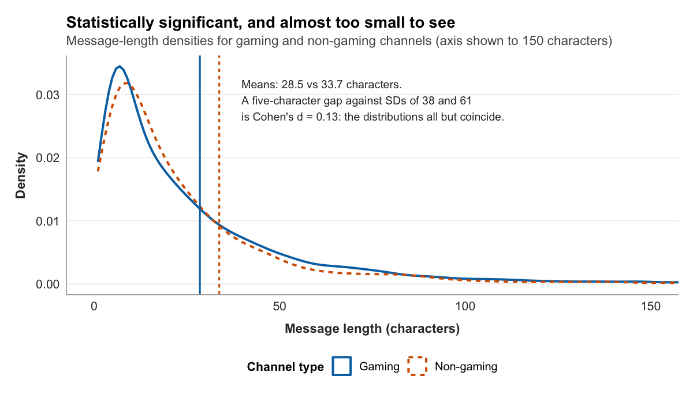
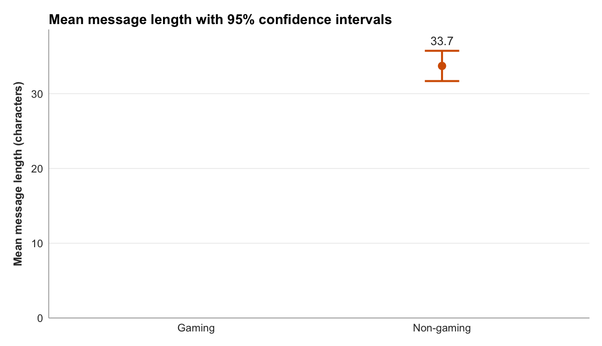

---
title: "Chapter 13: Making the call"
---

{fig-alt="A stylized rendering of a pointer on a dial poised between two regions."}

Chapter 12 ended on a number and a doubt. The number was a gap: across the sample, gaming channels averaged 28.49 characters per chat message and non-gaming channels 33.70, a difference of a little over five characters. The doubt was whether that gap means anything.

The doubt is not idle. A sample almost always shows some gap. Split any group of people in two at random, measure their heights, and the two averages will differ a little, not because the halves are truly different but because no two samples come out identically. The five-character gap between gaming and non-gaming chat could be a real difference between the two kinds of channel. It could also be the ordinary wobble that any two samples produce. Looking at the histogram cannot tell the two apart, because both possibilities produce a gap.

Settling that doubt is the job of **inferential statistics**, and it is the work of this chapter. The chapter's title names what is at stake. After describing a sample, a researcher eventually has to make a call: is the pattern in the data a real feature of the world, or is it noise that will not survive the next sample? Chapter 13 is where the chat study makes that call about its central finding.

## What a test actually asks

Start with what the question really is. The study did not measure those 34,766 messages because anyone cares about those particular messages. It measured them to learn something about gaming and non-gaming chat in general, the broad populations the sample stands in for. The sample is a means; the population is the point. And a sample, however carefully drawn, is not the population. It is a partial view, and partial views are noisy.

So the honest question is not "is there a gap in the sample," because there plainly is. It is "is the gap in the sample large enough that chance alone is an unconvincing explanation for it." That is the question a **hypothesis test** answers, and it answers it through a move that feels backward the first time.

The test does not start from the difference you suspect is real. It starts from its opposite, called the **null hypothesis**: the assumption that there is no real difference at all, that gaming and non-gaming chat have the same true mean length, and that the five-character gap is nothing but sampling noise. The test then asks a single question of the data: if the null hypothesis were true, how surprising would a gap this large be?

The logic is the logic of a skeptic. Imagine testing whether a coin is weighted by flipping it a hundred times. You would not try to prove it crooked directly. You would assume it fair, the null hypothesis, work out how often a fair coin would produce a result as lopsided as the one you got, and if that turned out to be a rare event, conclude that the fair-coin assumption is hard to believe. A hypothesis test treats the chat data the same way. Assume nothing is going on, measure how surprising the data are under that assumption, and if they are surprising enough, reject the assumption.

## Choosing the test

There is not one hypothesis test. There are many, and which one applies depends on the kind of data in hand. This is where the measurement levels from Chapter 8, the nominal, ordinal, interval, and ratio distinctions, stop being vocabulary and start doing work.

The chat study's question pairs one continuous variable with one categorical split. Message length is a ratio variable, an exact count of characters. Gaming status is a nominal variable with two values, gaming and non-gaming. A continuous outcome compared across two groups is the textbook setting for the **t-test**, and that is the test this chapter runs.

A different question would call for a different test. Suppose the study asked instead whether a channel's gaming status is associated with its audience size, pairing `is_gaming` with the `viewer_band` variable built in Chapter 11. Those are two categorical variables, and the test for an association between two categorical variables is the **chi-square test**, available as `v2v::run_chi_square()`. The study does not pursue that question here, but the point generalizes: the variables choose the test. The V2V Hub keeps a test-decision-tree that lays out the full mapping, and consulting it before running anything is the habit to build. A test applied to the wrong kind of data produces a number, and the number is meaningless.

## Running the test

The test itself is one function call. `v2v::run_t_test()` takes the data, the variable to compare, and the variable that splits it into groups:

```r
v2v::run_t_test(analysis, value = message_length, group = is_gaming)
```

```
Welch two-sample t-test
message_length by is_gaming

  Mean, gaming         28.49 characters
  Mean, non-gaming     33.70 characters
  Difference           -5.22 characters

  t                    -4.95
  df                   3768.7
  p-value              < .001
  Cohen's d            -0.13  (negligible)

  Gaming and non-gaming channels differ in mean message length by a
  statistically significant but negligible amount.
```

The test is named in the first line as a **Welch** two-sample t-test, and the choice of the Welch version is deliberate. The ordinary t-test assumes the two groups have the same spread, and Chapter 12 showed plainly that they do not: the non-gaming standard deviation, 60.68, is far larger than the gaming standard deviation of 38.47. Welch's t-test drops that assumption, which is why it is the safer default whenever two groups might vary by different amounts.

The rest of the output is the result, and it has three parts worth reading slowly. The `t` value, -4.95, measures the gap between the means in units of its own uncertainty: roughly, how many widths of sampling noise separate the two averages. A value near zero would mean the gap is small compared to the noise; a value of about five means it is large compared to the noise. The sign is only direction, negative because gaming, the first group, sits below non-gaming. The `df`, or degrees of freedom, is a number the test uses to turn `t` into a probability; Welch's test computes it from the two groups' sizes and spreads, which is why it is not a round number. And the `p-value` is the answer to the question the whole test was built to ask.

## Reading the p-value

The **p-value** reported here is "< .001," and stating exactly what that means takes care, because the p-value is the most misread number in statistics.

It means this: if gaming and non-gaming chat truly had the same mean message length, so that the null hypothesis were true, then drawing a sample with a gap at least as large as the observed five characters would happen less than one time in a thousand. The data are, in other words, very surprising under the assumption that nothing is going on. By the convention that researchers apply, a p-value below the threshold of .05 counts as **statistically significant**, and a p-value this small clears that bar easily. Chance alone is an unconvincing explanation for the gap.

That convention deserves a note of its own. The .05 threshold is exactly that, a convention, with no deep justification; a p-value of .049 and one of .051 describe almost identical evidence, and treating one as a discovery and the other as a non-event is a habit the field is right to question (Wasserstein & Lazar, 2016).

What matters more is being precise about what the p-value does not say. It is not the probability that the null hypothesis is true; the null is either true or false, and the p-value is a statement about data, not about hypotheses. It is not the probability that the result is a fluke. And, most important for what follows, it is not a measure of how large the difference is, or of how much the difference matters. A small p-value says the gap is probably not zero. It says nothing at all about whether the gap is big.

## How big is the difference

For that, the p-value has to hand the question to a different number: an **effect size**.

A p-value answers "is there a difference." An effect size answers "how much of one." The effect size for a gap between two means is **Cohen's d**, and it works by expressing the gap not in raw characters but in units of how much the data naturally vary. The output reports a Cohen's d of -0.13.

To read that number, it needs a yardstick, and the standard one comes from Jacob Cohen (1988), who proposed rough benchmarks: a d around 0.2 is a small effect, around 0.5 a medium one, and around 0.8 a large one. A d of 0.13, smaller than even the "small" benchmark, falls into the range usually called negligible. The difference between gaming and non-gaming message length is real, in the sense that the test ruled out chance, and it is also trivially small.

This is worth dwelling on, because it sounds like a contradiction and is not. The raw gap is about five characters, roughly fifteen percent of the non-gaming average, and fifteen percent does not sound negligible. But Cohen's d measures the gap against the spread of the data, and message lengths vary enormously, with standard deviations of thirty-eight and sixty-one characters. A five-character difference set against that much variation is a ripple. The percentage sounds substantial; the effect size, which is the honest comparison, is not.

{fig-alt="Two message-length density curves, one for gaming channels and one for non-gaming channels, drawn over an axis from zero to 150 characters. The curves rise to nearly the same peak below 20 characters and decay along nearly the same path; two vertical lines mark the group means at 28.5 and 33.7 characters, visibly close together. The five-character gap between the means, set against standard deviations of 38 and 61, is Cohen's d of 0.13: the distributions all but coincide."}

That leaves one question: how did a negligible difference come back statistically significant at all? The answer is the sample size. The test ran on 34,766 messages, and with a sample that large, a hypothesis test can detect a difference far too small to care about. This is the rule to carry forward: a large enough sample will make almost any difference, however tiny, statistically significant. Significance and size are different questions, and big samples pull them apart.

## Seeing the difference

The two facts, a real gap and a negligible one, are easier to hold together as a picture. Plotting each group's mean with its ninety-five percent confidence interval, a band that reflects how precisely the mean is estimated, puts both on the same axis:

```r
means_ci <- analysis |>
  filter(!is.na(is_gaming)) |>
  group_by(is_gaming) |>
  summarise(
    mean = mean(message_length, na.rm = TRUE),
    se   = sd(message_length, na.rm = TRUE) / sqrt(n()),
    .groups = "drop"
  ) |>
  mutate(
    lower = mean - 1.96 * se,
    upper = mean + 1.96 * se,
    group = if_else(is_gaming, "Gaming", "Non-gaming")
  )

ggplot(means_ci, aes(group, mean, colour = group)) +
  geom_errorbar(aes(ymin = lower, ymax = upper), width = 0.14, linewidth = 0.9) +
  geom_point(size = 3.4) +
  v2v::scale_colour_v2v() +
  scale_y_continuous(limits = c(0, NA)) +
  labs(x = NULL, y = "Mean message length (characters)") +
  v2v::theme_v2v() +
  theme(legend.position = "none")
```

{fig-alt="A dot-and-interval chart comparing two group means on a vertical axis of message length in characters that runs from zero to about thirty-six. Non-gaming channels average 33.7 characters and gaming channels 28.5, a gap of about five characters. Both confidence intervals are very short, and the two intervals do not overlap. But both means sit close together high on the axis, far above zero, showing how small the five-character gap is next to the message lengths themselves."}

The intervals are so short they nearly vanish behind the points, a direct consequence of the large sample: with tens of thousands of messages, each group's mean is pinned down precisely. That the two intervals do not overlap is the visual signature of a statistically significant difference. And yet the two points sit close together near the top of the axis, both far above zero, so the eye reads them as almost the same height. That is the negligible effect size made visible. The gap is real enough that the intervals clear each other, and small enough that against the scale of the data it barely shows.

## Statistical significance is not practical importance

Putting the two numbers together is the call the chapter is named for, and it is a more careful call than "significant or not."

The finding is this. Gaming and non-gaming channels do differ in their mean chat-message length; the difference is statistically significant, unlikely to be an accident of sampling. And the difference is negligible in size, about five characters, a word's worth, dwarfed by how much message lengths vary in the first place. Both halves are true, and a report that gave only the first half would mislead. A reader who heard "gaming and non-gaming chat differ significantly, p < .001" and nothing else would picture a real divide between two kinds of community. The effect size corrects the picture: there is a divide, and it is almost too small to see.

This is the difference between **statistical significance** and **practical significance**, and it is perhaps the single most important habit this book asks for. Statistical significance asks whether an effect is distinguishable from zero. Practical significance asks whether the effect is large enough to matter. They are not the same question, large samples make them diverge, and a finding is only honestly reported when both are on the page.

In practice that means a result is written up with the full set of numbers, in the compact form journals expect:

> Gaming channels produced shorter chat messages on average than non-gaming channels (28.49 vs. 33.70 characters), Welch's _t_(3768.7) = -4.95, _p_ < .001, Cohen's _d_ = -0.13.

And then, because a string of statistics is not an interpretation, it is written up a second time in a sentence a non-statistician can read: gaming and non-gaming channels do differ in how long their chat messages run, but the difference is so small that for most purposes the two are better thought of as alike than as different. That sentence is the call. It reports the real difference, refuses to inflate it, and tells the reader what the study actually found.

## More than two groups: ANOVA

The t-test settled a question with exactly two sides: gaming versus non-gaming. Many questions have more. Suppose the study asked not whether gaming and non-gaming chat differ, but whether chat length differs across the specific games being played. Keep each channel's game category, the modal category built in Chapter 11, alongside `is_gaming`, restrict the data to its four largest categories, and four means appear rather than two:

```
game category       n     mean length
Fortnite          4000       33.23
Hearthstone       3004       36.82
Just Chatting     2429       39.03
League of Legends 4000       22.63
```

A t-test cannot settle this, because a t-test compares two means and there are four. Comparing them two at a time, Fortnite against Hearthstone, Hearthstone against Just Chatting, and so on, is worse than useless: it takes six separate tests, each carrying its own chance of a false positive, and those chances pile up. The test built for the whole comparison at once is the **analysis of variance**, or **ANOVA**. It asks a single question of all the groups together: is any of these means different enough from the rest that chance is an unconvincing explanation? `aov()` fits it and `summary()` reports it:

```r
four_games <- analysis |>
  filter(game %in% c("Fortnite", "Hearthstone",
                     "Just Chatting", "League of Legends"))

summary(aov(message_length ~ game, data = four_games))
```

```
              Df    Sum Sq  Mean Sq  F value  Pr(>F)
game           3    547281   182427    92.26  < 2e-16 ***
Residuals  13429  26552407     1977
```

The logic is the t-test's logic, widened. Where the t-test produced a `t`, ANOVA produces an **F**, and F compares two kinds of variation: the variation *between* the group means against the variation *within* the groups. If the four categories truly shared a mean, the spread between them would be no larger than the ordinary noise inside each, and F would sit near one. Here F is 92.26, far above one, and the p-value is minuscule: the categories do not all share a mean. League of Legends chat, at 22.63 characters, runs visibly shorter than Just Chatting at 39.03.

And, exactly as with the t-test, significance is not size. The effect size for ANOVA is **eta-squared** (η²), the share of the total variation in message length that the game category accounts for. Here it is 0.02: category explains about two percent of the variation in how long messages run. The categories differ, the difference is real, and it is small, the same honest pair of facts the t-test forced.

## From difference to model: regression

The t-test and ANOVA both compare group means. A third tool asks a subtly different question: not "do the groups differ" but "can one variable predict another." That tool is **linear regression**, and its reach is wide enough to contain the other two.

Return to the original two-group question, but fit it as a regression, an `lm()`, a linear model of message length on gaming status:

```r
summary(lm(message_length ~ is_gaming, data = analysis))
```

```
              Estimate  Std. Error  t value  Pr(>|t|)
(Intercept)     33.70       0.70      48.16   < .001
is_gamingTRUE   -5.22       0.74      -7.08   < .001
```

Read the two numbers. The intercept, 33.70, is the mean message length of the reference group, non-gaming channels. The coefficient on `is_gamingTRUE`, -5.22, is exactly the gap the t-test found: gaming channels average 5.22 characters fewer. The regression has re-derived the t-test's result and cast it in a new form, a baseline plus an adjustment. (Its `t` of -7.08 differs a little from the Welch test's -4.95 because a plain regression pools the two groups' spread rather than letting them differ; the coefficient, the difference itself, is identical.)

That the regression reproduces the t-test is not a coincidence. A t-test is a regression with a single two-level predictor; an ANOVA is a regression with a single many-level predictor. All three belong to one framework, the **general linear model**, and once a study is written as a regression it can grow in ways a t-test cannot: a second predictor added, a continuous predictor rather than a categorical one, several influences weighed at once. This chapter's study needs only the two-group comparison, so the t-test is enough. But regression is where inference stops being a menu of separate tests and becomes one extensible way of modeling how one thing depends on another. Its effect size here tells the same story a third time: the model's R², the share of variance it explains, is about 0.001, so gaming status accounts for almost none of the variation in message length.

## Looking ahead

The chat study now has all of its pieces. It has a question and a theory, a prospectus, a codebook tested for reliability, a sample, a clean dataset, three figures, and a tested finding interpreted honestly. What it does not yet have is a form. The pieces are scattered across scripts and outputs, and a study that cannot be read as a single coherent document is not yet finished. Chapter 14 is where it becomes one. It is the publication chapter, where everything built since Chapter 9 is assembled into a single reproducible report and put where other people can read it.


::: {.content-visible when-profile="grad"}
::: {.callout-note title="Graduate Extension" collapse="true"}
**Three obligations that constrain graduate-level inference.** The undergrad edition teaches inference as a decision: given a *p*-value and a significance level, you accept or reject the null hypothesis. That logic is correct but incomplete. Graduate-level inference carries three additional obligations: (1) the inference must reflect the power of the study; (2) the significance threshold must be justified, not assumed; and (3) the pre-registration disclosure must precede the inference claim.

**Power and interpretation.** A significant result from a well-powered study (≥ 80%) is a stronger evidentiary claim than the same result from an underpowered study. Underpowered studies that achieve significance do so partly through sampling variation, which inflates effect size estimates. Report the achieved power of your study alongside the *p*-value. The v2v package's `run_t_test()` returns Cohen's *d* with confidence intervals, which allows readers to assess the precision of the effect estimate independently of the significance test.

**Justify your α.** The default *α* = .05 is a convention, not a law. If you ran 10 tests on the same dataset without correction, you expect at least one false positive by chance alone. Pre-registration mitigates this by requiring you to declare the number of tests and any correction procedure in advance. Report your chosen α, state why it is appropriate for your design, and apply it consistently.

**The pre-registration disclosure statement.** Every graduate V2V paper that used pre-registration includes: "This study's hypotheses, measures, and analysis plan were pre-registered on OSF prior to data collection at [URL]." Exploratory analyses conducted beyond the pre-registration are labeled as exploratory and interpreted with corresponding caution.

**The assumptions the tests rest on.** The undergraduate treatment runs `aov()` and `lm()` and reads the output. Graduate use checks the assumptions those numbers depend on before trusting them. ANOVA and ordinary regression assume the groups share a common variance (homoscedasticity); Chapter 12 showed the chat groups plainly do not, which is why the two-group test used Welch's correction, and the same heterogeneity argues for `oneway.test()` (Welch's ANOVA) over the pooled `aov()` used above. A significant ANOVA says only that *some* pair of means differs, not which; naming the pairs requires post-hoc comparisons (Tukey's HSD via `TukeyHSD()`) that correct for the multiple looks. A regression's credibility rests on its residuals: `plot(model)` produces the diagnostic quartet, residuals-versus-fitted for linearity and equal spread, a Q–Q plot for normal residuals, and leverage for influential points, and reading them is part of reporting a model, not an optional add-on. And when a model gains a predictor, whether the addition earns its place is a question of model comparison, adjusted R² and AIC across competing models or a nested *F*-test, not raw R², which never falls when a predictor is added.

**Required reading.** Lakens, D., Adolfi, F. G., Albers, C. J., Anvari, F., Apps, M. A. J., Argamon, S. E., … Zwaan, R. A. (2018). Justify your alpha. *Nature Human Behaviour*, *2*, 168–171. https://doi.org/10.1038/s41562-018-0311-x

**Reflect.** (1) For your pre-registered study, write the disclosure statement you would include in the methods section. List any deviations from the pre-registration and how you would report them. (2) Lakens et al. propose that different research contexts justify different α levels. What would justify using *α* = .01 rather than .05 in a V2V study? (3) Name the test your own design calls for (t-test, ANOVA, or regression), the assumption most at risk in your data, and the diagnostic or robust alternative you would use to check or handle it.
:::
:::
## References

Cohen, J. (1988). _Statistical power analysis for the behavioral sciences_ (2nd ed.). Lawrence Erlbaum Associates.

Wasserstein, R. L., & Lazar, N. A. (2016). The ASA's statement on p-values: Context, process, and purpose. _The American Statistician_, _70_(2), 129-133. https://doi.org/10.1080/00031305.2016.1154108
